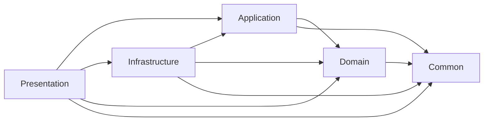

# Ride-Hailing System

## 1. Tổng quan

Hệ thống gọi xe mô phỏng (ride-hailing simulation) xây dựng bằng C# WinForms, áp dụng OOP và Layered Architecture. Hệ thống mô phỏng toàn bộ workflow chuyến đi: đặt xe, tìm tài xế, di chuyển, thanh toán và đánh giá.

**Mục tiêu:**

- Xây dựng logic nghiệp vụ (business logic)
- Áp dụng OOP: kế thừa, đa hình, encapsulation, domain events
- Tổ chức Layered Architecture (Domain → Application → Infrastructure → Presentation)
- Mô phỏng workflow chuyến đi với dữ liệu ảo (không dùng GPS thật)

**Công nghệ:**

- .NET Framework 4.8 Windows Forms
- GMap.NET (Google Maps provider) cho bản đồ
- JSON file-based persistence (`JsonStorage`)
- xUnit + Moq cho testing

---

## 1.1 Tóm tắt Kiến trúc và Điểm nổi bật

### 1. Kiến Trúc Hệ Thống (Architecture)

Hệ thống được tổ chức theo mô hình 4 lớp, giúp tách biệt rõ ràng trách nhiệm:

- **Presentation Layer (WinForms)**: Sử dụng Pattern Shell/Screen. Điều này cực kỳ quan trọng trong WinForms để tránh việc tạo ra các "God Objects" (các Form chứa hàng nghìn dòng code).
- **Application Layer**: Đóng vai trò là "người điều phối" (Orchestrator). Lớp này không chứa logic nghiệp vụ mà chỉ điều phối các Domain Service và Entity.
- **Domain Layer**: Trái tim của hệ thống. Việc sử dụng State Machine cho Trip và đảm bảo Domain "pure" (không phụ thuộc vào hạ tầng) là một điểm cộng lớn về kỹ thuật.
- **Infrastructure Layer**: Chứa chi tiết thực thi (Persistence, Google Maps API). Việc sử dụng Thread-safe Decorators cho Repositories cho thấy bạn đã tính toán đến vấn đề đa luồng (concurrency) khi nhiều Driver/Passenger cùng tương tác.

### 2. Luồng Xử Lý Chính (Core Workflows)

Hệ thống giải quyết được 3 bài toán khó nhất của một ứng dụng ride-hailing:

- **A. Quản lý trạng thái Trip**: Việc áp dụng State Machine nghiêm ngặt giúp ngăn chặn các lỗi logic như: "Bắt đầu chuyến đi khi chưa có tài xế" hoặc "Hủy chuyến khi đã hoàn thành". State Flow: Requested → Searching → Matched → Arrived → Started → Completed / Cancelled / Timeout.
- **B. Khớp tài xế (Driver Matching)**: Sử dụng SemaphoreSlim để xử lý tranh chấp (Race Condition) khi nhiều tài xế cùng nhấn "Chấp nhận" một chuyến xe là giải pháp chính xác trong môi trường ứng dụng desktop đa luồng.
- **C. Cơ chế Event-Driven**: Sử dụng EventDispatcher để decoupled (giảm sự phụ thuộc). Ví dụ: Khi Trip được tạo, TripService chỉ bắn ra TripRequestedEvent. Việc gửi thông báo hay log dữ liệu sẽ do các Handler khác thực hiện, giúp code sạch và dễ mở rộng.

### 3. Các Thực Thể Chính (Entities & Aggregates)

| Thực thể | Loại | Vai trò quan trọng |
|----------|------|-------------------|
| **Trip** | Aggregate Root (Domain.Aggregates) | Quản lý toàn bộ vòng đời chuyến đi: Requested → Searching → Matched → Arrived → Started → Completed/Cancelled/Timeout. Chứa Route (VO), Fare (VO), Reviews (VO). |
| **User** (abstract) | Aggregate Root (Domain.Aggregates) | Base class cho Passenger, Driver, Admin. Quản lý xác thực (Password hashing), profile (Name, Phone), trạng thái tài khoản (IsActive). |
| **Driver** | Entity (Domain.Entities) | Kế thừa User. Quản lý vị trí (Position: Location), xe (Vehicle: VehicleInfo VO), ví (Wallet: Money VO), thu nhập (Income: Money VO), trạng thái sẵn sàng, đánh giá. |
| **Passenger** | Entity (Domain.Entities, sealed) | Kế thừa User. Quản lý số chuyến đã đi (TotalTrips). |
| **Admin** | Entity (Domain.Entities) | Kế thừa User. Không có logic bổ sung. |
| **FareRule** | Entity (Domain.Entities, kế thừa Entity<Guid>) | Quy định giá cước: base fare, giá/km, tỷ lệ hoa hồng. Dùng để tính giá dynamic. |

**Value Objects quan trọng:**
- **Location** — Tọa độ đón/trả khách (lat, lng, Address)
- **Route** — Khoảng cách, thời gian, điểm đi/đến của chuyến
- **Money** — Số tiền với currency (VND)
- **Fare** — Tổng tiền + tỷ lệ hoa hồng (tính Commision/DriverIncome)
- **Review** — Đánh giá 1-5 sao + comment
- **VehicleInfo** (abstract) — Thông tin xe (DriverId, biển số, hãng, model, màu, sức chứa). **Lưu ý:** Hiện tại là abstract class (không phải VO hoặc Entity đích thực).
  - `Car`, `Motorbike` là concrete subclasses

**Domain Events (10):**
- Trip: Requested, Searching, Matched, Arrived, Started, Completed, Cancelled, Timeout
- Driver: StatusChanged, LocationUpdated

**State Machines:**
- TripStateMachine: 8 states với transitions hợp lệ
- DriverStateMachine: 3 states (Offline ↔ Available ↔ OnTrip)

**Domain Services:**
- `FareCalculationService` — Tính giá cước (simple formula hoặc dùng FareRule)
- `RouteValidationService` — Validate route data

### 4. Đặc điểm kỹ thuật nổi bật

- **Thread Safety**: Sử dụng khóa (locking) và decorators để đảm bảo dữ liệu không bị corrupt khi lưu file JSON từ nhiều luồng.
- **Validation**: Entity tự chịu trách nhiệm kiểm tra tính hợp lệ của chính nó.
- **Fallback Mechanism**: Có cơ chế dự phòng cho bản đồ (Google Maps → Haversine) đảm bảo hệ thống vẫn chạy khi mất kết nối API.

---

## 2. Solution Structure (Projects + Layer Mapping)

| Project          | Path                                                                                 | Output  | Layer Mapping              | Direct Project References                           |
| ---------------- | ------------------------------------------------------------------------------------ | ------- | -------------------------- | --------------------------------------------------- |
| `Application`    | `C:\Users\PC\source\repos\FinalProject\OOP2026\Application\Application.csproj`       | Library | Application                | `Common`, `Domain`                                  |
| `Common`         | `C:\Users\PC\source\repos\FinalProject\OOP2026\Common\Common.csproj`                 | Library | UNKNOWN (shared utilities) | None                                                |
| `Domain`         | `C:\Users\PC\source\repos\FinalProject\OOP2026\Domain\Domain.csproj`                 | Library | Domain                     | `Common`                                            |
| `Infrastructure` | `C:\Users\PC\source\repos\FinalProject\OOP2026\Infrastructure\Infrastructure.csproj` | Library | Infrastructure             | `Application`, `Common`, `Domain`                   |
| `Presentation`   | `C:\Users\PC\source\repos\FinalProject\OOP2026\Presentation\Presentation.csproj`     | WinExe  | Presentation               | `Application`, `Common`, `Domain`, `Infrastructure` |

Orphan file scan (on disk vs included in `.csproj`):

- `Application`: `Compile=78`, `Files=91`, `Orphans=13`
- `Common`: `Compile=7`, `Files=7`, `Orphans=0`
- `Domain`: `Compile=58`, `Files=61`, `Orphans=3`
- `Infrastructure`: `Compile=16`, `Files=24`, `Orphans=8`
- `Presentation`: `Compile=62`, `Files=62`, `Orphans=0`

---

## 7. Dependency Graph

---

## 8. Clean Architecture Violations (Based on Actual References + File Placement Only)

1. Presentation directly depends on Domain and Infrastructure.

- Evidence: [Presentation.csproj](C:/Users/PC/source/repos/FinalProject/OOP2026/Presentation/Presentation.csproj)
- Evidence: [Program.cs](C:/Users/PC/source/repos/FinalProject/OOP2026/Presentation/Program.cs) uses `Infrastructure.Config` and concrete repositories.
- Impact: UI can bypass application boundary.

2. ~~UI layer directly touches domain repositories/entities.~~

- ~~Evidence: [PassengerShell.cs](C:/Users/PC/source/repos/FinalProject/OOP2026/Presentation/Shells/PassengerShell.cs) depends on `IDriverRepository` and uses `Domain.Entities`.~~
- ~~Evidence: [DriverShell.cs](C:/Users/PC/source/repos/FinalProject/OOP2026/Presentation/Shells/DriverShell.cs) calls domain state methods (`SetAvailable`, `SetOffline`).~~
- ~~Impact: business/state rules leak into UI flow.~~
- Status: **RESOLVED** - Presentation layer now uses DTOs (DriverDto, PassengerDto, TripDto) instead of domain entities. Domain logic isolated in Application layer.

3. Duplicate abstraction boundary for route service.

- Evidence: [Application `IRouteService`](C:/Users/PC/source/repos/FinalProject/OOP2026/Application/Interfaces/IRouteService.cs)
- Evidence: [Infrastructure `IRouteService`](C:/Users/PC/source/repos/FinalProject/OOP2026/Infrastructure/Interfaces/IRouteService.cs)
- Impact: contract drift risk and adapter confusion.

4. File-placement inconsistency in Driver screen classes.

- Evidence: [DriverDashboardForm.cs](C:/Users/PC/source/repos/FinalProject/OOP2026/Presentation/Screens/Driver/DriverDashboardForm.cs) defines `DriverTripExecutionForm`.
- Evidence: [DriverTripExecutionForm.cs](C:/Users/PC/source/repos/FinalProject/OOP2026/Presentation/Screens/Driver/DriverTripExecutionForm.cs) also defines `DriverTripExecutionForm`.
- Evidence: `DriverDashboardForm.Designer.cs` defines `DriverDashboardForm`.
- Impact: maintenance ambiguity and designer/code-behind mismatch risk.

5. Multiple orphan service stacks not compiled (structure drift).

- Evidence: `Application` has 13 orphan `.cs` files including `Services/Implementations/*`, `Startup.cs`.
- Evidence: `Infrastructure` has 8 orphan `.cs` files including `Startup.cs`, `Simulation/*`, `BackgroundJobs/*`.
- Impact: "code on disk" diverges from "code in build".

6. Domain model duplication by placement.

- Evidence: [Domain/ValueObjects/Vehicle.cs](C:/Users/PC/source/repos/FinalProject/OOP2026/Domain/ValueObjects/Vehicle.cs) is compiled.
- Evidence: [Domain/Entities/Vehicle.cs](C:/Users/PC/source/repos/FinalProject/OOP2026/Domain/Entities/Vehicle.cs) exists but is orphan (not in `.csproj`).
- Impact: conceptual ambiguity (`Vehicle` meaning differs by folder).

7. No compile-time evidence of `Domain -> Infrastructure` reference.

- Check result: no `using Infrastructure` in Domain code; Domain project references only `Common`.
- Conclusion: previously suspected domain purity violation is **UNCLEAR by compile reference**, but structural ambiguity exists due orphan files.

**Architecture Improvement Note:**

- Presentation layer violations (items 1-2) have been resolved by implementing DTO pattern
- Core UI forms (PassengerShell, DriverShell, BookTripForm) now use DTOs instead of domain entities
- Domain business logic properly isolated in Application layer
- Clean Architecture compliance improved for Presentation layer
