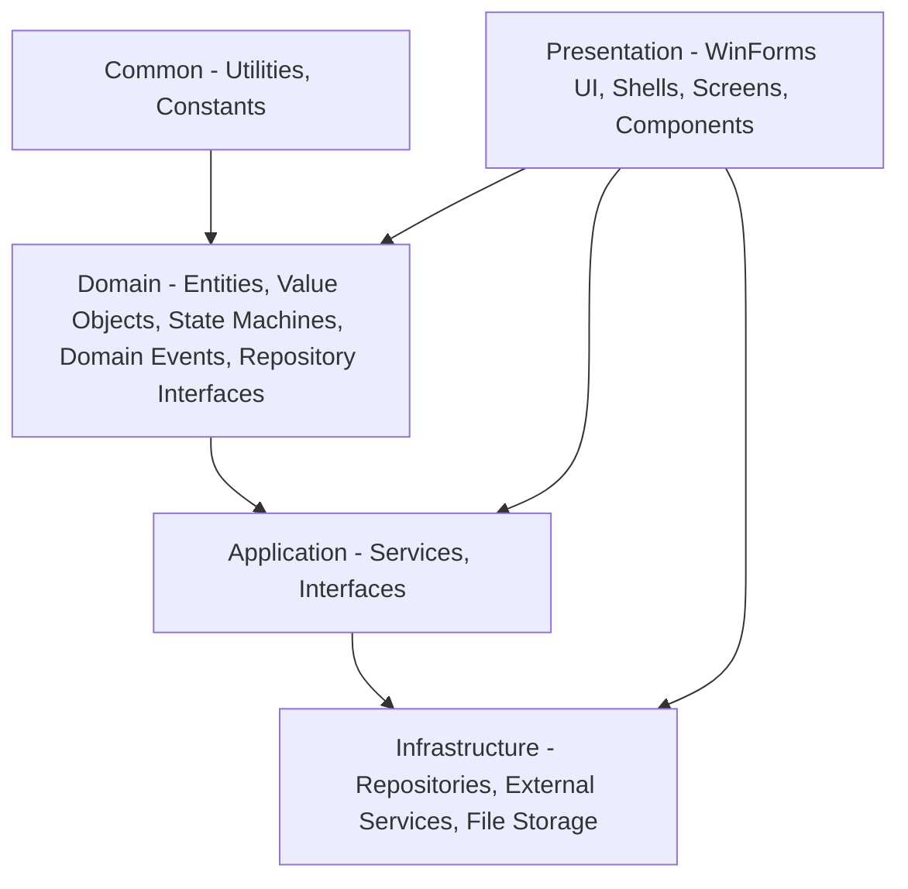
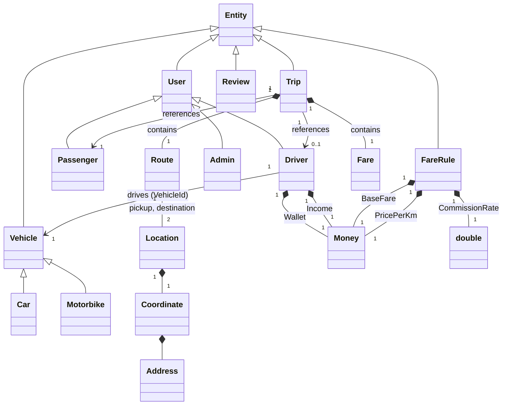
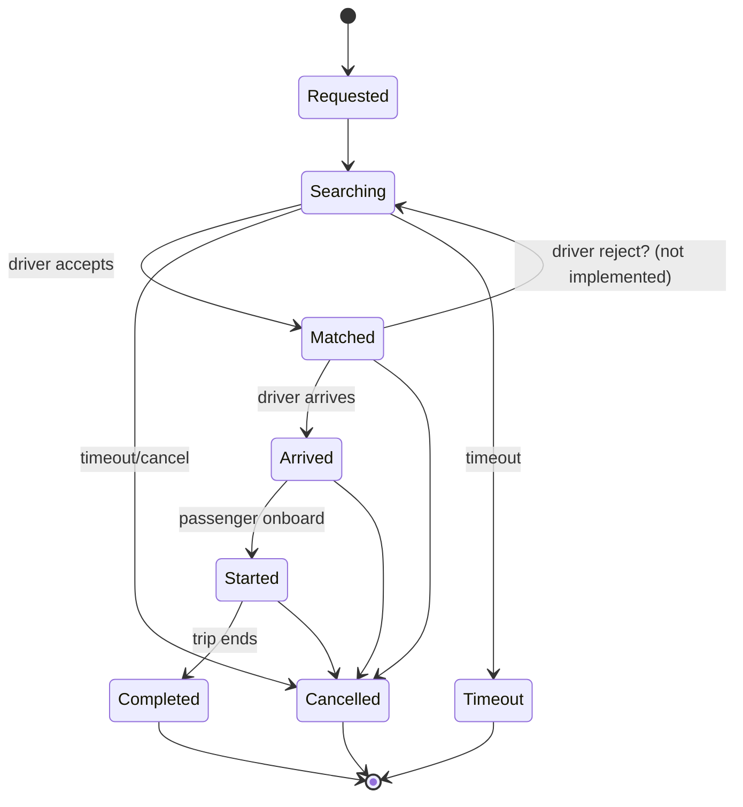
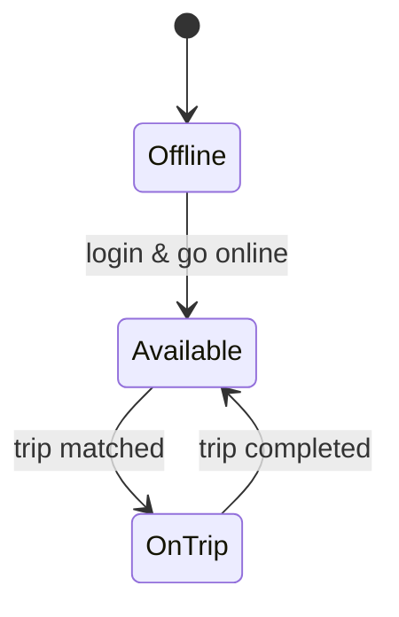

# RideGo — Hệ Thống Mô Phỏng Ride-Hailing trên .NET Framework 4.8

> **Nền tảng:** C# WinForms · .NET Framework 4.8 · GMap.NET 2.1.7 · Newtonsoft.Json · Manual Service Composition

---

## 1. Tổng Quan Hệ Thống

RideGo là hệ thống gọi xe mô phỏng (ride-hailing simulation) xây dựng bằng C# WinForms, mô phỏng toàn bộ workflow chuyến đi: đặt xe → tìm tài xế → di chuyển → thanh toán → đánh giá.

### Mục tiêu

- Xây dựng logic nghiệp vụ (business logic) hoàn chỉnh
- Áp dụng bốn trụ cột OOP: Kế thừa, Đa hình, Đóng gói, Trừu tượng
- Mô phỏng workflow chuyến đi với dữ liệu ảo (không sử dụng GPS thật)

### Công nghệ


| Thành phần           | Chi tiết                                       |
| -------------------- | ---------------------------------------------- |
| Runtime              | .NET Framework 4.8                             |
| UI                   | Windows Forms                                  |
| Bản đồ               | GMap.NET.WinForms 2.1.7 (Google Maps provider) |
| Serialization        | Newtonsoft.Json                                |
| Service Composition  | Manual — khởi tạo bằng `new` trong `Program.cs` |
| Actor                | Passenger, Driver, Admin                       |
| Lưu trữ              | File JSON                                      |


---

## 2. Coding Rules (Bắt Buộc)


| Quy tắc             | Mục đích giáo khoa                      | Cách triển khai                                               |
| ------------------- | --------------------------------------- | ------------------------------------------------------------- |
| **Không LINQ**      | Nắm vững cấu trúc dữ liệu và giải thuật | Dùng `foreach` + `if-else` thay cho `Where`, `FirstOrDefault` |
| **Không `var`**     | Rèn luyện tư duy Static Typing          | `Passenger p = new Passenger();` thay vì `var p = ...`        |
| **Không Lambda**    | Hiểu rõ cơ chế Delegate và Method       | Khai báo phương thức tường minh thay vì `(x => x.Id)`         |
| **Newtonsoft.Json** | Persistence & Data Stream               | `JsonConvert.SerializeObject` / `DeserializeObject`           |


---

## 3. Kiến Trúc Phân Lớp (5-Layer Architecture)




**Nguyên tắc vàng:** Luồng phụ thuộc (Dependency Flow) nên hướng vào Domain. Trạng thái hiện tại có một số vi phạm:

- Presentation tham chiếu trực tiếp Domain và Infrastructure.
- Infrastructure tham chiếu Domain.
Những vi phạm này làm giảm tính testability và tăng coupling. Cần refactor để Presentation chỉ phụ thuộc vào Application.

### Chi tiết các tầng


| Tầng               | Trách nhiệm                                           | Thành phần đặc trưng                                                                                                                                                                      |
| ------------------ | ----------------------------------------------------- | ----------------------------------------------------------------------------------------------------------------------------------------------------------------------------------------- |
| **Common**         | Tiện ích chung, hằng số, extension methods            | `Common/Utilities`, `Common/Constants`, `Common/Extensions`                                                                                                                               |
| **Domain**         | Quy tắc nghiệp vụ cốt lõi, không phụ thuộc bên thứ ba | Entities, Value Objects, State Machines (`Domain.StateMachines`), Domain Events, Repository Interfaces (`Domain/Repositories`)                                                            |
| **Application**    | Điều phối use case, quy trình nghiệp vụ               | Services (`TripService`, `UserService`, `FareService`, `MatchingService`...), Interfaces (`Application.Interfaces`) |
| **Infrastructure** | Giao tiếp bên ngoài, lưu trữ dữ liệu                  | `JsonRepository<T>`, `FileStorage`, `MapService` (implements `IMapService`), repository implementations (`Infrastructure.Repositories`)                                                   |
| **Presentation**   | Giao diện tương tác ngườ dùng                        | WinForms Shells (`MainShell`, `PassengerShell`, `DriverShell`, `AdminShell`), Screens (`Screens/`*), Components (`Components/*`), ViewModels, Helpers, Manual composition root (`Program.cs`) |


### Manual Service Composition

Composition root nằm ở `Presentation/Program.cs` — khởi tạo toàn bộ dependencies bằng `new` trực tiếp (không dùng DI container):

- `JsonStorage<T>` (Infrastructure)
- Repositories (Infrastructure)
- Application services
- Background workers (`TripTimeoutWorker`, `TripMatchingWorker`)

Các UI forms nhận dependencies qua constructor (manual pass).

---

## 4. Mô Hình Domain

### 4.1 Phân Cấp Kế Thừa

```
Entity (Domain.SharedKernel, abstract)
├── User (abstract)
│   ├── Passenger
│   ├── Driver
│   └── Admin
├── Vehicle (abstract)
│   ├── Car
│   └── Motorbike
├── Trip
├── FareRule
└── Review
```

### 4.2 Class Diagram (Tóm tắt)




### 4.3 Entities


| Thực thể             | Thuộc tính đặc trưng                                                                                                                                                         | Hành vi đặc trưng                                                                                                                                          |
| -------------------- | ---------------------------------------------------------------------------------------------------------------------------------------------------------------------------- | ---------------------------------------------------------------------------------------------------------------------------------------------------------- |
| `User` (abstract)    | `Id`, `Name`, `Phone`, `Password` (hashed), `IsActive`                                                                                                                       | `UpdateName()`, `ChangePassword()`, `VerifyPassword()`                                                                                                     |
| `Passenger`          | `TotalTrips`                                                                                                                                                                 | `AddTrip()`                                                                                                                                                |
| `Driver`             | `Status (DriverStatus)`, `Position (Location)`, `VehicleId`, `Wallet (Money)`, `Income (Money)`, `TotalTrips`, `AverageRating`, `RatingSum`, `TotalReviews`, `LicenseNumber` | `SetAvailable()`, `SetOnTrip()`, `SetOffline()`, `UpdatePosition()`, `AddTrip()`, `PayCommission()`, `DepositToWallet()`, `UpdateReviews(int rating)`                |
| `Admin`              | (kế thừa User)                                                                                                                                                               | Quản lý người dùng, cấu hình hệ thống                                                                                                                      |
| `Vehicle` (abstract) | `PlateNumber`, `Brand`, `Model`, `Color`, `Capacity`, `Type (VehicleType)`                                                                                                   | `GetAvgSpeed()`, `GetMaxPickupDistance()` (abstract)                                                                                                       |
| `Car`                | `Type = Car`                                                                                                                                                                 | `AvgSpeed = 60km/h`, `MaxPickupDistance = 7km`                                                                                                             |
| `Motorbike`          | `Type = Motorbike`                                                                                                                                                           | `AvgSpeed = 40km/h`, `MaxPickupDistance = 5km`                                                                                                             |
| `Trip`               | `Status (TripStatus)`, `PassengerId`, `DriverId?`, `TripVehicleType`, `TripRoute (Route)`, `TripFare (Fare)`, `IsPaid`, `RequestAt`                                          | State transitions: `SetSearching()`, `MatchDriver()`, `MarkAsArrived()`, `StartTrip()`, `CompleteTrip()`, `Cancel()`, `MarkTimeout()`; emits domain events |
| `FareRule`           | `VehicleType`, `BaseFare (Money)`, `PricePerKm (Money)`, `CommissionRate`                                                                                                    | `CalculateFare(distanceKm)` → `Fare`                                                                                                                       |
| `Review`             | `DriverId`, `PassengerId`, `TripId`, `Rating (1-5)`, `Comment`, `CreatedAt`                                                                                                  | `UpdateReview()`                                                                                                                                           |


### 4.4 Value Objects


| Value Object | Thành phần                                                                                                  | Ghi chú                                             |
| ------------ | ----------------------------------------------------------------------------------------------------------- | --------------------------------------------------- |
| `Money`      | `Amount` (decimal, 2 dp), `Currency` (string, mặc định "VND")                                               | Immutable, operators `+`, `-`, `<`, `>`, `<=`, `>=` |
| `Coordinate` | `Latitude`, `Longitude` (double)                                                                            | Primitive wrapper                                   |
| `Address`    | Các trường: `Name`, `Street`, `District`, `City`, `Country`, `HouseNumber`, `Osm_Value`, `Locality`         | Lấy từ Geocoding API                                |
| `Location`   | `Coordinate` + `Address`                                                                                    | Composition — bất biến                              |
| `Route`      | `Pickup (Location)`, `Destination (Location)`, `Distance (km)`, `Duration (TimeSpan)`, `Polyline` (encoded) | Immutable; composition của hai `Location`           |
| `Fare`       | `TotalAmount (Money)`, `Commission (Money)`, `DriverIncome` (derived)                                       | Immutable                                           |


### 4.5 Domain Events

Các events được định nghĩa trong các namespace con của `Domain`:

**Trip Events** (`Domain.Events`):

- `TripRequestedEvent`, `TripSearchingEvent`, `TripMatchedEvent`, `TripArrivedEvent`, `TripStartedEvent`, `TripCompletedEvent`, `TripPaidEvent`, `TripCancelledEvent`, `TripTimeoutEvent`

**Driver Events** (`Domain.Events`):

- `DriverStatusChangedEvent`, `DriverLocationUpdatedEvent`

**Review Events** (`Domain.Events`):

- `ReviewCreatedEvent`

### 4.6 Repository Interfaces

Các interface định nghĩa trong `Domain/Repositories`:

- `IRepository<T>` where T : Entity — base CRUD
- `IReadRepository<T>` — read-only operations
- Specific: `IUserRepository`, `IDriverRepository`, `IPassengerRepository`, `ITripRepository`, `IVehicleRepository`, `IReviewRepository`, `IFareRuleRepository`

---

## 5. State Machine

### 5.1 Trip State Flow




**Bảng chuyển trạng thái:**


| Từ        | Đến       | Điều kiện                  |
| --------- | --------- | -------------------------- |
| Requested | Searching | Trip được tạo              |
| Searching | Matched   | Tài xế chấp nhận           |
| Searching | Cancelled | Hành khách hủy             |
| Searching | Timeout   | Hết thời gian tìm tài xế   |
| Matched   | Arrived   | Tài xế đến điểm đón        |
| Matched   | Cancelled | Hủy trước khi lên xe       |
| Matched   | Searching | Tài xế từ chối (chưa impl) |
| Arrived   | Started   | Khách lên xe               |
| Arrived   | Cancelled | Khách không lên xe         |
| Started   | Completed | Đến nơi, thanh toán        |
| Started   | Cancelled | Hủy trong khi đang chạy    |


`ITripState` implementations validate transitions before delegating to `Trip.TransitionTo(...)`. `DriverStateMachine.CanTransition(from, to)` kiểm tra tính hợp lệ cho Driver.

### 5.2 Driver State Flow




`DriverStateMachine.CanTransition` tương tự. Các thay đổi trạng thái thực hiện qua các phương thức `SetAvailable()`, `SetOnTrip()`, `SetOffline()` trên aggregate Driver.

### 5.3 Domain Events

Mỗi transition có thể phát ra event tương ứng, ví dụ:

- `SetSearching()` → `TripSearchingEvent`
- `MatchDriver()` → `TripMatchedEvent`
- `MarkAsArrived()` → `TripArrivedEvent`
- `StartTrip()` → `TripStartedEvent`
- `CompleteTrip()` → `TripCompletedEvent`, `TripPaidEvent`
- `Cancel()` → `TripCancelledEvent`

---

## 6. Design Patterns

### 6.1 Repository

`IRepository<T>` (Domain) → `JsonRepository<T>` (Infrastructure) → Concrete repositories. Triển khai không dùng LINQ, duyệt list.

### 6.2 State Machine

`ITripState` implementations (`Domain.States`) validate Trip lifecycle transitions; `DriverStateMachine` validates Driver status transitions. Thay thế switch-case, đảm bảo chỉ trạng thái hợp lệ mới được thiết lập.

### 6.3 Domain Events & Observer

Aggregates phát domain events; `TripService` phát sự kiện `TripStatusChanged` để UI (PassengerForm, DriverForm, AdminForm) subscribe và cập nhật real-time. Loose coupling.

### 6.4 Value Object

`Money`, `Location`, `Route`, `Fare` — immutable, value equality, operator overloading.

### 6.5 Data Transfer Object (DTO)

No dedicated DTO folder exists; domain entities and primitive types are passed directly between Application and Presentation.

### 6.6 CQRS-lite

No dedicated `Application/Features` folder exists. UI calls Application Service interfaces directly (e.g., `ITripService.CreateTripAsync()`, `IMatchingService.MatchDriverToTripAsync()`).

### 6.7 Manual Service Composition

Không sử dụng DI container. Composition root tại `Presentation/Program.cs` khởi tạo tất cả dependencies bằng `new`, bao gồm cả Infrastructure types. Các forms nhận services qua constructor do code tự quản lý.

---

## 7. Logic Nghiệp Vụ

### 7.1 Tính Giá Cước

```
TotalFare = BaseFare + Distance × PricePerKm
Commission = TotalFare × CommissionRate
DriverIncome = TotalFare − Commission
```

`FareRule` lưu các tham số theo `VehicleType`. `FareRule.CalculateFare(distance)` trả về `Fare` (value object).

**Lưu ý:** `FareService` hiện chưa sử dụng `IRouteService` (chưa được định nghĩa). Logic tính giá dựa vào `FareRule` và `distance` được truyền vào.

### 7.2 Ghép Tài Xế

`MatchingService.MatchDriverToTripAsync` kiểm tra:

1. Driver tồn tại
2. `Driver.Status == Available`
3. Trip tồn tại và ở trạng thái `Searching`
4. `VehicleType` của tài xế khớp với yêu cầu của chuyến
5. Gọi `trip.MatchDriver(driverId)` để chuyển trạng thái

**Chưa triển khai:**

- Tính khoảng cách từ tài xế đến điểm đón (dùng Haversine hoặc routing API)
- Kiểm tra số dư ví tài xế (để trừ hoa hồng dự kiến)
- Lọc thô theo địa chỉ hành chính (phường/quận)

### 7.3 Xử Lý Địa Chỉ

Chưa có logic lọc tài xế theo địa chỉ hành chính (phường/quận).

### 7.4 Race Condition & Timeout

Chưa có cơ chế khóa đồng thời (`SemaphoreSlim`) khi nhiều tài xế cùng chấp nhận một chuyến. Background workers (`TripTimeoutWorker`, `TripMatchingWorker`) đã được triển khai trong `Infrastructure/BackgroundJobs/` — khởi tạo bằng `new` trong `Program.cs`.

---

## 8. GMap.NET

### 8.1 Thành phần

`MapControl` (Presentation.Components) — UserControl wrap `GMapControl`. Hiển thị markers (hành khách, tài xế) và routes (nếu có).

### 8.2 Cấu hình

```csharp
gMapControl.MapProvider = GMapProviders.GoogleMap;
gMapControl.AccessMode = AccessMode.ServerAndCache;
gMapControl.ShowCenter = false;
gMapControl.DragButton = MouseButtons.Left;
gMapControl.MouseWheelZoomEnabled = true;
```

### 8.3 Mô phỏng Di chuyển

Chưa triển khai mô phỏng di chuyển thực tế. `SimulationService` hiện là stub, không có timer cập nhật vị trí.

### 8.4 Polyline & Routing

Infrastructure cung cấp `IMapService` và `MapService` (sử dụng Photon Geocoding API và OSRM Routing API). Tuy nhiên, service này chưa được tích hợp đầy đủ vào luồng đặt xe. Polyline trả về từ routing API chưa được giải mã và hiển thị trên map.

---

## 9. Pseudocode — Các Luồng Chính

### 9.1 `CreateTripAsync`

```
FUNCTION CreateTripAsync(passengerId, pickup, destination, vehicleType):
    distance ← CalculateDistance(pickup, destination)  // Haversine fallback
    duration ← EstimateDuration(distance)
    route ← new Route(pickup, destination, distance, duration, polyline: "")
    fare ← FareService.CalculateFare(vehicleType, distance)
    trip ← new Trip(passengerId, route, fare, vehicleType)
    trip.SetSearching()
    TripRepository.Add(trip)
    await SaveChangesAsync()
    RETURN trip
```

### 9.2 `MatchDriverAsync`

```
FUNCTION MatchDriverAsync(tripId, driverId):
    trip ← TripRepository.GetByIdAsync(tripId)
    driver ← DriverRepository.GetByIdAsync(driverId)
    IF trip.Status ≠ Searching THEN throw InvalidOperationException
    IF driver.Status ≠ Available THEN throw InvalidOperationException
    trip.MatchDriver(driverId)
    driver.SetOnTrip()
    TripRepository.Update(trip)
    DriverRepository.Update(driver)
    await SaveChangesAsync()
```

### 9.3 `CompleteTrip`

```
FUNCTION CompleteTrip(tripId, fareAmount):
    trip ← TripRepository.GetById(tripId)
    fare ← new Money(fareAmount)
    trip.CompleteTrip(fare)
    IF trip.DriverId.HasValue:
        driver ← DriverRepository.GetById(trip.DriverId.Value)
        driver.SetAvailable()
        driver.AddTrip()
        driver.PayCommission(trip.TripFare)
        DriverRepository.Update(driver)
        DriverRepository.SaveChangesAsync()
    passenger ← PassengerRepository.GetById(trip.PassengerId)
    passenger.AddTrip()
    PassengerRepository.Update(passenger)
    PassengerRepository.SaveChangesAsync()
    TripRepository.SaveChanges()
```

---

## 10. Use Cases


| ID   | Use Case                 | Actor              | Mô tả                                    | Trạng thái                                |
| ---- | ------------------------ | ------------------ | ---------------------------------------- | ----------------------------------------- |
| UC1  | Đăng nhập                | User               | Nhập phone + password                    | ✅                                         |
| UC2  | Đăng ký tài xế           | Driver             | Nhập thông tin + vehicle                 | ✅                                         |
| UC3  | Đăng ký hành khách       | Passenger          | Nhập name, phone, password               | ✅                                         |
| UC4  | Đặt chuyến               | Passenger          | Chọn pickup, destination, loại xe        | ✅ (sync)                                  |
| UC5  | Ghép tài xế              | System             | Tìm tài xế Available phù hợp             | ⚠️ (chỉ check status)                     |
| UC6  | Đến điểm đón             | Driver             | Status → Arrived                         | ✅                                         |
| UC7  | Bắt đầu chuyến           | Driver             | Status → Started                         | ✅                                         |
| UC8  | Hoàn thành chuyến        | Driver             | Status → Completed                       | ✅                                         |
| UC9  | Đánh giá                 | Passenger          | Rating + comment                         | ✅                                         |
| UC10 | Hủy chuyến               | Passenger / Driver | Lưu lý do hủy                            | ✅                                         |
| UC11 | Lịch sử chuyến đi        | Passenger / Driver | Xem lịch sử                              | ✅                                         |
| UC12 | Thông tin tài xế matched | Passenger          | Xem tài xế + xe tìm được                 | ✅                                         |
| UC13 | Trạng thái làm việc      | Driver             | Bật/tắt Available                        | ✅                                         |
| UC14 | Nhận thông tin chuyến    | Driver             | Xem thông tin Trip được yêu cầu          | ✅                                         |
| UC15 | Chấp nhận / Từ chối      | Driver             | Accept hoặc Reject chuyến                | ⚠️ (chưa hoàn chỉnh)                      |
| UC16 | Admin theo dõi real-time | Admin              | Xem chuyến đang diễn ra trên map         | ⚠️ (UI cơ bản)                            |
| UC17 | Cấu hình FareRule        | Admin              | Điều chỉnh giá cước, hoa hồng            | ✅                                         |
| UC18 | Driver Radar             | Passenger          | Xem tài xế gần khi đang searching        | ❌                                         |
| UC19 | Thu nhập tài xế          | Driver             | Xem Income + lịch sử giao dịch           | ⚠️ (Driver có Income, UI chưa)            |
| UC20 | Báo cáo thống kê         | Admin              | GMV, NTR, tỷ lệ hoàn thành, satisfaction | ✅                                         |
| UC21 | Dẫn đường                | Driver             | Điều hướng đến điểm đón / điểm trả       | ⚠️ (MapControl hiển thị, chưa tính đường) |
| UC22 | Sửa thông tin cá nhân    | User               | Cập nhật name, phone...                  | ⚠️ (có service, UI chưa)                  |


---

## 11. Xử Lý Ngoại Lệ & Tính Bền Vững


| Tình huống           | Giải pháp                                                     |
| -------------------- | ------------------------------------------------------------- |
| Mất kết nối internet | Chưa xử lý; có thể chuyển `AccessMode.CacheOnly` của GMap.NET |
| Tắt app đột ngột     | Lưu sau mỗi thao tác quan trọng (repositories)                |
| Xung đột ID dữ liệu  | Dùng `Guid` làm khóa chính                                    |
| UI Freeze khi vẽ map | Double Buffering, chỉ Invalidate marker thay đổi              |


---

## 12. KPIs (Admin Dashboard)


| Chỉ số               | Mô tả                                 | Nguồn dữ liệu               | Trạng thái  |
| -------------------- | ------------------------------------- | --------------------------- | ----------- |
| **GMV**              | Tổng giá trị chuyến đi                | `Trip.TripFare.TotalAmount` | Chưa tính   |
| **NTR**              | Doanh thu hệ thống giữ lại            | `Trip.TripFare.Commission`  | Chưa tính   |
| **Tỷ lệ hoàn thành** | `Completed / (Completed + Cancelled)` | `TripRepository`            | Có thể tính |
| **Satisfaction**     | Điểm đánh giá trung bình              | `Driver.AverageRating`      | Có thể tính |


---

## 13. Quan Hệ OOP — Tóm Tắt


| Quan hệ         | Ví dụ                                                                        |
| --------------- | ---------------------------------------------------------------------------- |
| **Inheritance** | `Entity → User → Driver/Passenger/Admin`; `Entity → Vehicle → Car/Motorbike` |
| **Composition** | `Trip` contains `Route` và `Fare`; `Route` contains `Location`               |
| **Aggregation** | `Driver` references `VehicleId` (không sở hữu)                               |
| **Association** | `Trip` references `PassengerId`, `DriverId` (Guid)                           |
| **Dependency**  | `Trip` uses `TripStateMachine` để kiểm tra chuyển trạng thái                 |
| **Abstraction** | `Vehicle.GetAvgSpeed()` là abstract, lớp con override                        |


---

**Lưu ý:** Tài liệu này phản ánh trạng thái mã nguồn hiện tại. Một số thành phần được tham chiếu nhưng chưa triển khai đầy đủ (ví dụ: `IRouteService`, `TripTimeoutWorker`, `TripMatchingWorker`). Kiến trúc chưa hoàn hảo và cần refactor để đạt Clean Architecture thuần túy.