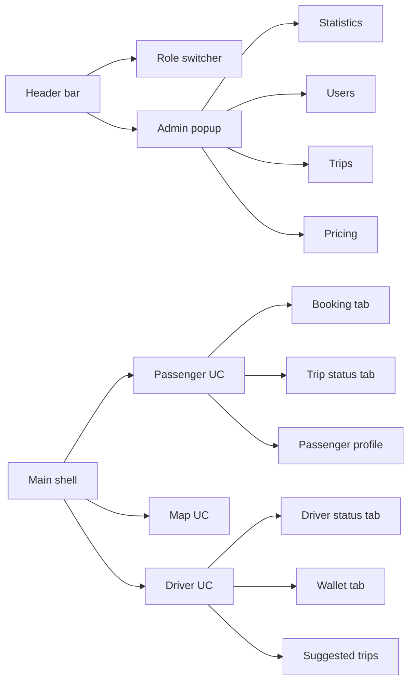

# Plan for Multi Role Ride Hailing UI Specification

**Date:** 2026-05-27 00:24
**User:** Project owner
**Goal:** Implement the provided WinForms multi-role ride-hailing interface specification for Passenger, Driver, Map, Authentication, and Admin screens while preserving existing services. Color accuracy is not a priority; do not spend implementation effort on changing shared color definitions.

## Current Findings

- Main shell already exists in `OOP2026/Form/FrmMultiRole.cs` and `OOP2026/Form/FrmMultiRole.Designer.cs` with a header and three-column layout.
- Passenger and driver home controls already exist in `OOP2026/UserControl/ucPassengerHome.Designer.cs` and `OOP2026/UserControl/ucDriverHome.Designer.cs`, but they still use hardcoded colors/fonts and simpler layouts.
- Auth shell exists in `OOP2026/Form/FrmAuth.Designer.cs`, but it is much simpler than the requested role-specific login/register flows.
- Admin shell exists in `OOP2026/Form/FrmAdmin.Designer.cs`, but statistics/users/trips/pricing tabs need expansion and layout cleanup.
- Existing UI refactor plan in `agent/plan/plan_winforms_ui_rules_refactor.md` is a secondary maintenance reference. For this UI-spec task, prioritize structure, controls, states, and navigation over color-token cleanup.

## Implementation Steps

- [ ] Step 1: Refine main multi-role shell - files: `OOP2026/Form/FrmMultiRole.cs`, `OOP2026/Form/FrmMultiRole.Designer.cs` - action: align header bar, role switcher cards, trip status label, online driver count, admin button, and three-column proportions. Reuse existing colors or local colors as convenient.
- [ ] Step 3: Refactor auth shell - files: `OOP2026/Form/FrmAuth.cs`, `OOP2026/Form/FrmAuth.Designer.cs` - action: support passenger/driver tag context, close button, login/register toggle, demo account fill, and role-colored headers.
- [ ] Step 4: Complete passenger auth fields - files: `OOP2026/Form/FrmPassengerAuth.cs`, `OOP2026/Form/FrmPassengerAuth.Designer.cs` if still used, or merge behavior into `OOP2026/Form/FrmAuth.cs` - action: login phone/password and register full name/phone/password.
- [ ] Step 5: Complete driver auth fields - files: `OOP2026/Form/FrmDriverAuth.cs`, `OOP2026/Form/FrmDriverAuth.Designer.cs` if still used, or merge behavior into `OOP2026/Form/FrmAuth.cs` - action: login phone/password and register identity, license, vehicle type, plate, brand, model, color, and seats for cars.
- [ ] Step 6: Update passenger home shell - files: `OOP2026/UserControl/ucPassengerHome.cs`, `OOP2026/UserControl/ucPassengerHome.Designer.cs` - action: header account details, four icon tabs, active underline styling, and stacked content controls with BringToFront navigation.
- [ ] Step 7: Refine booking tab - files: `OOP2026/UserControl/ucBooking.cs`, `OOP2026/UserControl/UcBooking.Designer.cs`, `OOP2026/UserControl/ucLocationPicker.cs`, `OOP2026/UserControl/UcLocationPicker.Designer.cs`, `OOP2026/UserControl/ucFareSelector.cs`, `OOP2026/UserControl/ucFareSelector.Designer.cs` - action: pickup/dropoff input states, car/bike selector, estimated duration/distance, active-trip warning, disabled booking state.
- [ ] Step 8: Refine passenger trip/searching state - files: `OOP2026/UserControl/ucTripStatus.cs`, `OOP2026/UserControl/UcTripStatus.Designer.cs`, `OOP2026/UserControl/ucTripCard.cs`, `OOP2026/UserControl/UcTripCard.Designer.cs` - action: status message, progress bar, selected service badge, trip summary, and cancel button.
- [ ] Step 9: Refine passenger profile - files: `OOP2026/UserControl/ucProfile.cs`, `OOP2026/UserControl/UcProfile.Designer.cs` - action: account stats, edit button, old/new password inputs, and change-password button.
- [ ] Step 10: Update driver home shell - files: `OOP2026/UserControl/ucDriverHome.cs`, `OOP2026/UserControl/ucDriverHome.Designer.cs` - action: avatar, name, phone, status, rating, completed trips, vehicle line, five icon tabs, active orange underline.
- [ ] Step 11: Refine driver status tab - files: `OOP2026/UserControl/ucDriverStatus.cs`, `OOP2026/UserControl/UcDriverStatus.Designer.cs` - action: wallet balance and two horizontal stat cards for total income and total trips.
- [ ] Step 12: Refine wallet tab - files: `OOP2026/UserControl/ucWallet.cs`, `OOP2026/UserControl/UcWallet.Designer.cs` - action: top-up title, three quick amount buttons, manual amount input, selected quick amount state, and top-up button.
- [ ] Step 13: Refine driver profile and suggested trips - files: `OOP2026/UserControl/ucProfile.cs`, `OOP2026/UserControl/UcProfile.Designer.cs`, `OOP2026/UserControl/ucRequest.cs`, `OOP2026/UserControl/ucRequest.Designer.cs` - action: driver info, password change, suggested trips count, route details, payout, total fare, distance/time, reject and accept buttons.
- [ ] Step 14: Refine admin shell - files: `OOP2026/Form/FrmAdmin.cs`, `OOP2026/Form/FrmAdmin.Designer.cs` - action: fixed popup, no maximize/minimize, blue header, close button, four-tab menu, active tab highlight and underline.
- [ ] Step 15: Implement admin statistics tab - files: `OOP2026/Form/FrmAdmin.cs`, `OOP2026/Form/FrmAdmin.Designer.cs`, `OOP2026/UserControl/ucStatCard.cs`, `OOP2026/UserControl/UcStatCard.Designer.cs`, `OOP2026/UserControl/ucUserCount.cs`, `OOP2026/UserControl/ucUserCount.Designer.cs` - action: four KPI cards, user counts, and trip-status counts.
- [ ] Step 16: Implement admin users tab - files: `OOP2026/Form/FrmAdmin.cs`, `OOP2026/Form/FrmAdmin.Designer.cs` - action: expandable user cards with role, phone, status, id, registered date, trip count, and driver-specific details.
- [ ] Step 17: Implement admin trips tab - files: `OOP2026/Form/FrmAdmin.cs`, `OOP2026/Form/FrmAdmin.Designer.cs` - action: expandable trip cards with route, customer, date, amount, status, participants, distance/time, fare details, driver income, and commission.
- [ ] Step 18: Implement admin pricing tab - files: `OOP2026/Form/FrmAdmin.cs`, `OOP2026/Form/FrmAdmin.Designer.cs`, `OOP2026/UserControl/ucPolicyCard.cs`, `OOP2026/UserControl/ucPolicyCard.Designer.cs` - action: display current car/bike policies and update form for base fare, per-km fare, and commission.
- [ ] Step 19: Run functional UI audit - files: all modified `.cs` and `.Designer.cs` files - action: verify naming is understandable, navigation works, and business logic remains out of designer files. Do not block on hardcoded colors.
- [ ] Step 20: Verify behavior - action: build solution, open main shell, switch passenger/driver auth, navigate each tab, create/search/cancel trip, open admin window, and verify data-binding remains functional.

## Verification

- Build: compile `OOP2026.slnx` or project `OOP2026/OOP2026.csproj`.
- Manual UI smoke test: launch app, inspect main shell, passenger tabs, driver tabs, auth popups, and admin tabs.
- Static audit: check designer files for custom logic and verify the intended controls/states exist. Hardcoded colors are acceptable for this task.

## Risks

- Medium: Existing auth forms may have overlapping responsibilities; implementation must decide whether to consolidate into `FrmAuth` or preserve separate passenger/driver auth forms.
- Medium: `ucProfile` may be shared by passenger and driver, so role-specific UI must avoid breaking one role while enhancing the other.
- Medium: Admin expandable lists may require new helper methods or small reusable controls to keep `FrmAdmin.cs` maintainable.
- Low: Emoji icons may render differently on Windows depending on font support.
- Low: Layout proportions may need minor visual tuning after opening the app.

## Clarifications Needed

- Confirm whether auth should be consolidated into `FrmAuth` or continue using separate `FrmPassengerAuth` and `FrmDriverAuth` forms behind the role switcher.
- Confirm whether the requested UI must be pixel-close to the specification or functionally equivalent with the current WinForms style system.

## Mermaid Overview

## Sources

- User-provided UI specification in current chat.
- Existing project files listed in workspace.
- Existing UI rules plan: `agent/plan/plan_winforms_ui_rules_refactor.md`, except color cleanup is explicitly deprioritized by user instruction.
