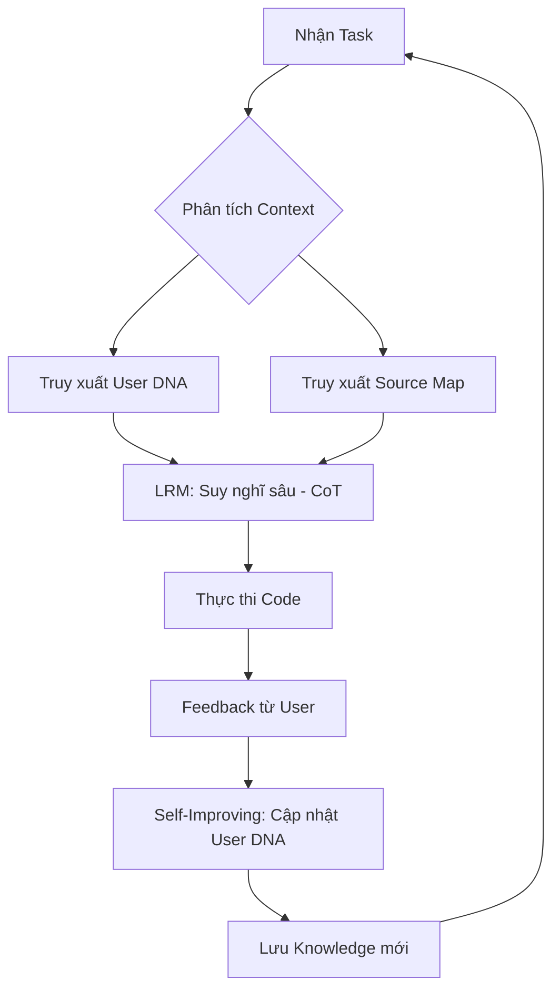

# Kế hoạch Nâng cấp Hệ thống Quy tắc và Tự cải tiến (Self-Improving)

**Ngày:** 2026-05-28
**Người dùng:** Trần Yến Phượng
**Mục tiêu:** Tối ưu hóa `.roo/rules/rules.md` và thiết kế hệ thống lưu trữ tri thức bền vững, tích hợp các kỹ thuật AI tiên tiến.

## 1. Cấu trúc mới cho `.roo/rules/rules.md`

### 1.1. Thông tin Người dùng & Task (Đầu file)
- **User Profile**: Name, Role, Tech Stack, Experience Level.
- **Global Context**: Task chính, mục tiêu tổng thể của dự án.
- **Communication Style**: Đa nghi, Hoàn hảo, Ngắn gọn.

### 1.2. Quản lý File bền vững
- **Nguyên tắc TRIM & COMPRESS**: Tự động tóm tắt các mục cũ khi file vượt quá giới hạn dung lượng (ví dụ: > 500 lines).
- **Cấu trúc Append-only với Metadata**: Mỗi mục thêm vào phải có timestamp và tag để dễ dàng lọc/xóa.

## 2. Thiết kế Hệ thống Tự tiến hóa (Self-Improving)

### 2.1. agent/self_improving.md (Cá nhân hóa)
- **User DNA**: Ghi lại các thói quen, sở thích code, và cách phản ứng của người dùng.
- **Closed-Loop ICL**: Sử dụng kết quả từ các task trước làm context cho task hiện tại (In-Context Learning).
- **Retraining Simulation**: Định kỳ tổng hợp dữ liệu để cập nhật "hiến pháp" làm việc của Agent.

### 2.2. agent/knowledge.md (Tri thức ngành)
- **LRM (Large Reasoning Models)**: Quy tắc ép Agent suy nghĩ sâu (Chain of Thought) trước khi đưa ra giải pháp cho task phức tạp.
- **Technical Debt Tracking**: Ghi nhận các điểm chưa hoàn hảo để cải thiện sau.

### 2.3. agent/source_map.md (Bản đồ dự án)
- Cập nhật tự động sau mỗi thay đổi kiến trúc lớn.
- Phân cấp rõ ràng: Domain -> Application -> Infrastructure -> Presentation.

## 3. Các bước thực hiện

- [ ] **Bước 1**: Cập nhật phần đầu file `.roo/rules/rules.md` với thông tin người dùng và Task chính.
- [ ] **Bước 2**: Thêm các quy tắc về "Quản lý File bền vững" vào mục 3 (Context & Memory Management).
- [ ] **Bước 3**: Nâng cấp mục 2 (Feedback Loop & Self-Reflection) với các khái niệm LRM và Closed-Loop ICL.
- [ ] **Bước 4**: Định nghĩa cấu trúc chuẩn cho các file trong thư mục `agent/`.
- [ ] **Bước 5**: Kiểm tra tính nhất quán và hiệu quả của các quy tắc mới.

## 4. Rủi ro & Giải pháp
- **Rủi ro**: File rules quá dài làm loãng context.
- **Giải pháp**: Sử dụng cấu trúc phân tầng, chỉ load các rule cần thiết cho từng mode.

## 5. Mermaid Diagram: Luồng Tự cải tiến

