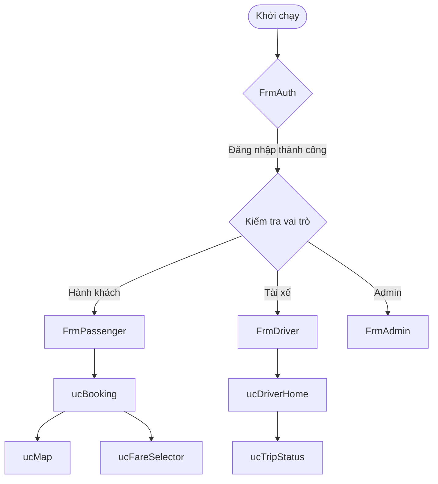

# Kế hoạch Review UI/UX chuyên sâu - Dự án OOP2026 (WinForms)

**Ngày:** 2026-05-27
**Vai trò:** Chuyên gia Code Review & Kiểm thử UI/UX
**Mục tiêu:** Rà soát toàn bộ giao diện người dùng (Forms & UserControls) để phát hiện lỗi, cải thiện trải nghiệm người dùng và đảm bảo tính nhất quán kỹ thuật.

## 1. Danh mục kiểm tra (Checklist)

### A. Bố cục & Độ phản hồi (Layout & Responsiveness)
- [ ] Kiểm tra `Anchor` và `Dock` của các control để đảm bảo giao diện không bị vỡ khi thay đổi kích thước Form.
- [ ] Sử dụng `TableLayoutPanel` và `FlowLayoutPanel` thay cho tọa độ tuyệt đối ở những nơi cần co giãn linh hoạt.
- [ ] Kiểm tra `MinimumSize` và `MaximumSize` của các Form chính.
- [ ] Đảm bảo `AutoScaleMode` được thiết lập đồng nhất (khuyến nghị: `Dpi` hoặc `Font`).

### B. Tính nhất quán (Visual Consistency)
- [ ] Kiểm tra việc sử dụng `UIHelper.Colors` và `UIHelper.Typography`. Loại bỏ các mã màu/font hardcoded.
- [ ] Đảm bảo khoảng cách (Padding/Margin) giữa các thành phần đồng nhất (ví dụ: 8px, 12px, 16px).
- [ ] Kiểm tra kích thước nút bấm (Button) và ô nhập liệu (TextBox) có đồng bộ trên toàn hệ thống không.

### C. Trải nghiệm người dùng & Phản hồi (UX & Feedback)
- [ ] **Validation:** Kiểm tra logic kiểm tra dữ liệu đầu vào. Sử dụng `ErrorProvider` thay vì chỉ đổi màu nền hoặc hiện `MessageBox` liên tục.
- [ ] **Loading States:** Đảm bảo có con trỏ chờ (`Cursors.WaitCursor`) hoặc ProgressBar/Spinner khi thực hiện tác vụ `async`.
- [ ] **Error Handling:** Thông báo lỗi phải thân thiện, rõ ràng và có hướng dẫn khắc phục.
- [ ] **Navigation:** Luồng chuyển đổi giữa các Form/UserControl phải mượt mà, không bị nháy (flicker).

### D. Khả năng truy cập (Accessibility)
- [ ] Kiểm tra `TabIndex` của tất cả các control (phải theo thứ tự từ trên xuống dưới, từ trái sang phải).
- [ ] Thiết lập `AcceptButton` (Enter) và `CancelButton` (Esc) cho các Form.
- [ ] Kiểm tra phím tắt (Mnemonic - ví dụ: `&Đăng nhập`).

### E. Chất lượng Code UI (Code Quality)
- [ ] Kiểm tra việc giải phóng tài nguyên (`Dispose`) cho các thành phần đặc biệt (GMap, Timer, v.v.).
- [ ] Đảm bảo các tác vụ nặng (I/O, API) được chạy `async/await` để không làm treo UI (UI Thread).
- [ ] Tách biệt logic xử lý dữ liệu ra khỏi file `.cs` của Form (tuân thủ Single Responsibility).

## 2. Các bước thực hiện

### Bước 1: Kiểm tra Hệ thống Style & Helper
- File: [`OOP2026/UIHelper.cs`](OOP2026/UIHelper.cs)
- Nội dung: Rà soát bảng màu, font chữ và các hàm tiện ích UI.

### Bước 2: Review Nhóm Form Xác thực (Authentication)
- Files: [`FrmAuth.cs`](OOP2026/Form/FrmAuth.cs), [`FrmPassengerAuth.cs`](OOP2026/Form/FrmPassengerAuth.cs), [`FrmDriverAuth.cs`](OOP2026/Form/FrmDriverAuth.cs)
- Trọng tâm: Logic chuyển đổi Login/Register, Validation thời gian thực, trải nghiệm Demo.

### Bước 3: Review Nhóm Form Vai trò (Role-based Forms)
- Files: [`FrmPassenger.cs`](OOP2026/Form/FrmPassenger.cs), [`FrmDriver.cs`](OOP2026/Form/FrmDriver.cs), [`FrmAdmin.cs`](OOP2026/Form/FrmAdmin.cs)
- Trọng tâm: Bố cục Dashboard, Menu điều hướng, tích hợp UserControl.

### Bước 4: Review Nhóm UserControl chức năng
- Files: `ucBooking`, `ucTrip`, `ucMap`, `ucLocationPicker`, `ucFareSelector`, v.v.
- Trọng tâm: Tính tái sử dụng, truyền nhận dữ liệu giữa các UC, hiệu năng vẽ (GDI+).

### Bước 5: Tổng hợp & Đề xuất sửa lỗi
- Tạo báo cáo chi tiết các lỗi phát hiện được và phân loại theo mức độ nghiêm trọng (Critical, Major, Minor).

## 3. Sơ đồ luồng UI chính (Mermaid)

## 4. Rủi ro tiềm ẩn
- **Flickering:** Việc thay đổi UserControl liên tục trên một Panel có thể gây nháy hình. Cần kiểm tra `DoubleBuffered`.
- **Memory Leak:** Các sự kiện (Event) không được hủy đăng ký (`-=`) khi UserControl bị Dispose.
- **Thread Safety:** Cập nhật UI từ luồng ngầm (Background Thread) mà không dùng `Invoke`.

---
**Bạn có đồng ý với kế hoạch này không? Tôi sẽ bắt đầu thực hiện rà soát chi tiết từng phần sau khi bạn xác nhận.**
