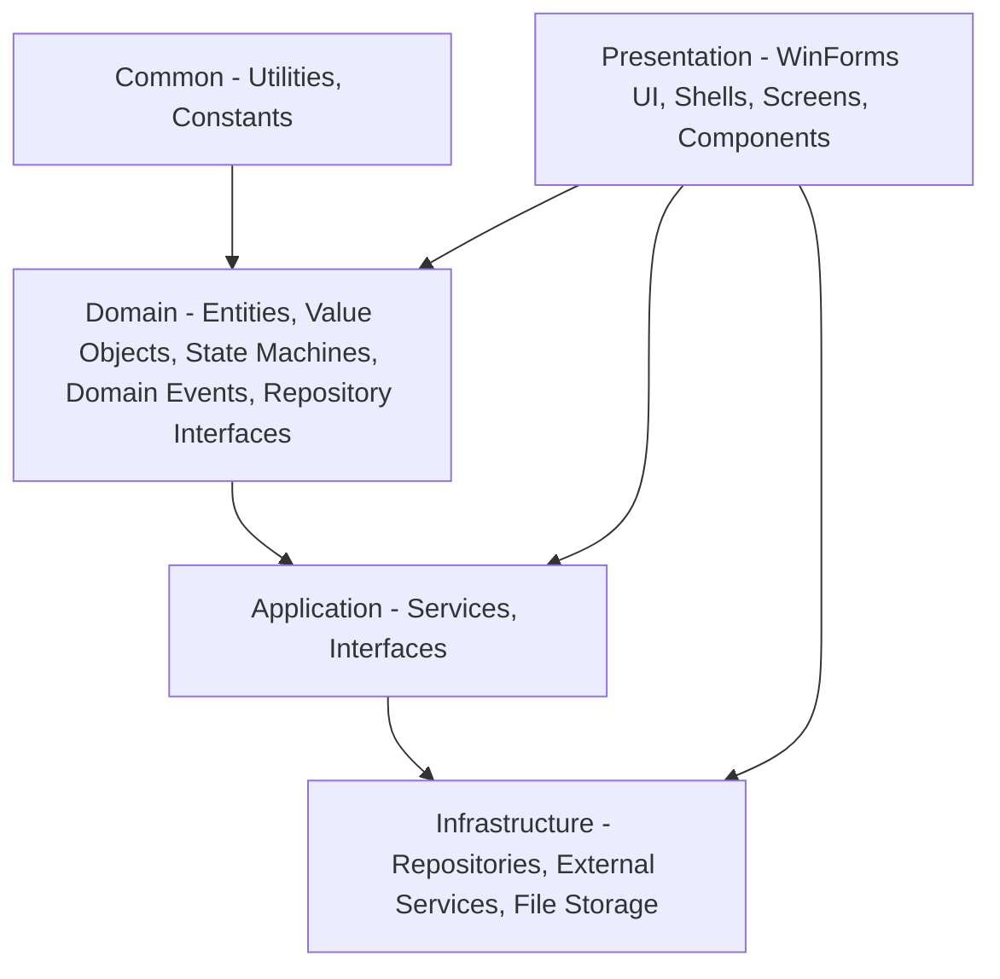

# RideGo — Architecture & Design Reference

> **Platform:** .NET Framework 4.8 · C# 7.3 · WinForms · Manual Service Composition
> **Applies to:** Ride-Hailing Simulation System (OOP2026)

---

## Table of Contents

1. [Overview](#1-overview)
2. [Dependency Rule & Pipeline](#2-dependency-rule--pipeline)
3. [Layer Architecture](#3-layer-architecture)
4. [Project Structure](#4-project-structure)
5. [Domain Model](#5-domain-model)
6. [State Machines](#6-state-machines)
7. [Domain Events](#7-domain-events)
8. [Design Patterns](#8-design-patterns)
9. [Application Services](#9-application-services)
10. [Repository & Persistence](#10-repository--persistence)
11. [External Services](#11-external-services)
12. [Manual Service Composition](#12-manual-service-composition)
13. [Use Cases](#13-use-cases)
14. [Business Logic](#14-business-logic)
15. [Naming Conventions](#15-naming-conventions)
16. [Coding Rules](#16-coding-rules)
17. [Checklist for New Files](#17-checklist-for-new-files)
18. [Known Gaps](#18-known-gaps)

---

## 1. Overview

RideGo is a ride-hailing simulation system built with C# WinForms, simulating the full trip workflow: book trip → find driver → travel → payment → rating.

### Goals

- Build complete business logic
- Apply four OOP pillars: Inheritance, Polymorphism, Encapsulation, Abstraction
- Simulate trip workflow with virtual data (no real GPS)

### Technology Stack

| Component           | Details                                         |
| ------------------- | ----------------------------------------------- |
| Runtime             | .NET Framework 4.8                              |
| UI                  | Windows Forms                                   |
| Map                 | GMap.NET.WinForms 2.1.7 (Google Maps provider)  |
| Serialization       | Newtonsoft.Json                                 |
| Service Composition | Manual — instantiate with `new` in `Program.cs` |
| Actors              | Passenger, Driver, Admin                        |
| Storage             | JSON files                                      |

---

## 2. Dependency Rule & Pipeline

### Dependency Flow

```
Outer → Inner (outer layers depend on inner layers)

Presentation → Application → Infrastructure → Domain → Common
```

**Project References (.csproj):**

| Project        | References                                                            |
| -------------- | --------------------------------------------------------------------- |
| Presentation   | Application, Common, Domain, Infrastructure _(violation — see below)_ |
| Application    | Common, Domain                                                        |
| Infrastructure | Application, Common, Domain                                           |
| Domain         | Common                                                                |
| Common         | _(none)_                                                              |

**Current violation:** Presentation references Domain and Infrastructure directly. Per Clean Architecture, Presentation should only reference Application (and Common for shared types).

### Pipeline (RideGo WinForms)

```
User Action (Button Click / Timer Tick)
  → WinForms Event Handler (Presentation)
    → Application Service Interface (ITripService, IUserService...)
      → Application Service Implementation
        → Domain Entity / State Machine
          → Repository Interface (Domain)
            → JsonRepository<T> (Infrastructure)
              → FileStorage → data/*.json
```

- **Observer Pattern** replaces middleware: `TripService.TripStatusChanged` event is subscribed by Forms for real-time UI updates without polling.
- **Composition Root** at `Program.cs` (Presentation) — initializes entire service graph with `new` directly (manual composition, no DI container).

**Note vs Web API pattern:**

- No HTTP middleware — replaced by WinForms event pipeline
- No MediatR — UI event handler calls Application Service directly
- No EF Core — replaced by `JsonRepository<T>` + `FileStorage`

---

## 3. Layer Architecture

### 5-Layer Architecture



| Layer              | Responsibility                                   | Key Components                                                                                    |
| ------------------ | ------------------------------------------------ | ------------------------------------------------------------------------------------------------- |
| **Common**         | Shared utilities, constants, extension methods   | `Common/Utilities`, `Common/Constants`, `Common/Extensions`                                       |
| **Domain**         | Core business rules, no third-party dependencies | Entities, Value Objects, State Machines, Domain Events, Repository Interfaces                     |
| **Application**    | Use case orchestration, business workflow        | Services (`TripService`, `UserService`, `FareService`, `MatchingService`...), Interfaces          |
| **Infrastructure** | External communication, data storage             | `JsonRepository<T>`, `FileStorage`, `MapService`, Repository implementations                      |
| **Presentation**   | User interaction                                 | WinForms Shells, Screens, Components, ViewModels, Helpers, Manual composition root (`Program.cs`) |

### Composition Root

Composition root is at `Presentation/Program.cs` — all dependencies initialized with `new`:

- `JsonStorage<T>` (Infrastructure)
- Repositories (Infrastructure)
- Application services
- Background workers (`TripTimeoutWorker`, `TripMatchingWorker`)

UI forms receive dependencies via constructor (manual pass).

---

## 4. Project Structure

```
RideGo2026/
├── Application/
│   ├── Interfaces/       # IAdminService, IDriverService, IFareService, IMapService,
│   │                     # IMatchingService, IPassengerService, IReviewService,
│   │                     # ISimulationService, ITripService, IUserQueryService, IUserService
│   └── Services/         # AdminService, DriverService, FareService, MapService,
│                         # MatchingService, PassengerService, ReviewService,
│                         # SimulationService (stub), TripService, UserService
├── Domain/
│   ├── Enums/            # DriverStatus, TripStatus, VehicleType.  **TripStatus sẽ bị xóa trong vòng đời sau này, chỉ dùng state pattern từ `ITripState`.**
│   ├── Entities/         # FareRule, Review, Trip, User (abstract),
│   │                     # Users/Admin, Driver, Passenger; Vehicles/Car, Motorbike, Vehicle
│   ├── Events/           # 9 Trip events, 2 Driver events, ReviewCreatedEvent
│   ├── SharedKernel/     # Entity.cs, ValueObject.cs, DomainEvent.cs
│   ├── StateMachines/    # DriverStateMachine.cs (static class)
│   ├── States/           # ITripState.cs + 8 state implementations
│   ├── Repositories/     # IRepository<T>, ITripRepository, IDriverRepository, etc.
│   └── ValueObjects/     # Address, Coordinate, Fare, Location, Money, Route
├── Infrastructure/
│   ├── ExternalServices/ # GMapService.cs, MapApiService.cs
│   ├── Interfaces/       # IFileStorageService, IFareRuleRepository, IGMapService, IMapApiService
│   └── Repositories/     # JsonRepository<T>, concrete repos, FileStorage, JsonStorage
├── Presentation/
│   ├── Components/       # DriverCardControl, FarePanel, LocationCard,
│   │                     # LocationPickerControl, MapControl, StatusPanel,
│   │                     # TripCard, TripStatusPanel
│   ├── Helpers/          # AlertHelper, DataMapper, EventHelper, MapHelper, UIHelper
│   ├── Screens/          # Auth/, Passenger/, Driver/, Admin/
│   ├── Shells/           # MainShell, PassengerShell, DriverShell, AdminShell
│   ├── ViewModels/       # PassengerViewModel, DriverViewModel, AdminViewModel, TripViewModel
│   ├── BaseForm.cs, BaseShell.cs, BaseUserControl.cs
│   └── Program.cs        # Manual composition root
└── Common/
    ├── Constants/        # FareConstants, SimulationConstants
    ├── Extensions/       # StringExtensions, DecimalExtensions
    └── Utilities/        # PasswordHasher
```

**Reserved folders (currently empty):** `Application/Features/`, `Application/DTOs/`, `Application/Behaviors/`, `Application/Mappings/`

---

## 5. Domain Model

### Inheritance Hierarchy

```
Entity (Domain.SharedKernel, abstract)
├── User (abstract)
│   ├── Passenger
│   ├── Driver
│   └── Admin
├── Vehicle (abstract)
│   ├── Car
│   └── Motorbike
├── Trip
├── FareRule
└── Review
```

### Entities

| Entity               | Key Properties                                                                                                                     | Key Behaviors                                                                                                                                         |
| -------------------- | ---------------------------------------------------------------------------------------------------------------------------------- | ----------------------------------------------------------------------------------------------------------------------------------------------------- |
| `User` (abstract)    | `Id`, `Name`, `Phone`, `Password` (hashed), `IsActive`                                                                             | `UpdateName()`, `ChangePassword()`, `VerifyPassword()`                                                                                                |
| `Passenger`          | `TotalTrips`                                                                                                                       | `AddTrip()`                                                                                                                                           |
| `Driver`             | `Status`, `Position`, `VehicleId`, `Wallet`, `Income`, `TotalTrips`, `AverageRating`, `RatingSum`, `TotalReviews`, `LicenseNumber` | `SetAvailable()`, `SetOnTrip()`, `SetOffline()`, `UpdatePosition()`, `AddTrip()`, `PayCommission()`, `DepositToWallet()`, `UpdateReviews(int rating)` |
| `Admin`              | (inherits User)                                                                                                                    | User management, system configuration                                                                                                                 |
| `Vehicle` (abstract) | `PlateNumber`, `Brand`, `Model`, `Color`, `Capacity`, `Type`                                                                       | `GetAvgSpeed()` (abstract)                                                                                                                            |
| `Car`                | `Type = Car`                                                                                                                       | `AvgSpeed = 60km/h`                                                                                                                                   |
| `Motorbike`          | `Type = Motorbike`                                                                                                                 | `AvgSpeed = 40km/h`                                                                                                                                   |
| `Trip`               | `Status` (string từ `ITripState`), `PassengerId`, `DriverId?`, `VehicleType`, `Route`, `Fare`, `IsPaid`, `RequestAt`               | State transitions: `SetSearching()`, `MatchDriver()`, `MarkAsArrived()`, `StartTrip()`, `CompleteTrip()`, `Cancel()`, `MarkTimeout()`                 |
| `FareRule`           | `VehicleType`, `BaseFare`, `PricePerKm`, `CommissionRate`                                                                          | `CalculateFare(distanceKm)` → `Fare`                                                                                                                  |
| `Review`             | `DriverId`, `PassengerId`, `TripId`, `Rating`, `Comment`, `CreatedAt`                                                              | `UpdateReview()`                                                                                                                                      |

### Value Objects

| Value Object | Components                                                                              | Notes                                               |
| ------------ | --------------------------------------------------------------------------------------- | --------------------------------------------------- |
| `Money`      | `Amount` (decimal, 2dp), `Currency` (default "VND")                                     | Immutable, operators `+`, `-`, `<`, `>`, `<=`, `>=` |
| `Coordinate` | `Latitude`, `Longitude` (double)                                                        | Primitive wrapper                                   |
| `Address`    | `Name`, `Street`, `District`, `City`, `Country`, `HouseNumber`, `Osm_Value`, `Locality` | From Geocoding API                                  |
| `Location`   | `Coordinate` + `Address`                                                                | Composite — immutable                               |
| `Route`      | `Pickup`, `Destination`, `Distance`, `Duration`, `Polyline` (encoded)                   | Immutable; composition of two `Location`            |
| `Fare`       | `TotalAmount`, `Commission`, `DriverIncome` (computed)                                  | Immutable                                           |

### Repository Interfaces (Domain)

- `IRepository<T>` — base CRUD: Add, Update, Delete, GetAll, GetById, SaveChangesAsync, InitializeAsync
- `IReadRepository<T>` — read-only: GetAllAsync, GetByIdAsync
- Specific: `IUserRepository`, `IDriverRepository`, `IPassengerRepository`, `ITripRepository`, `IVehicleRepository`, `IReviewRepository`, `IFareRuleRepository`

---

### Trip — State Pattern

`Trip` delegates state behavior to `ITripState` implementations.

### Driver — State Pattern

`Driver` delegates state behavior to `IDriverState` implementations.

| State Class | Valid Next States |
| ----------- | ----------------- |
| `RequestedState` | Searching |
| `SearchingState` | Matched, Cancelled, Timeout |
| `MatchedState` | Arrived, Cancelled, Searching |
| `ArrivedState` | Started, Cancelled |
| `StartedState` | Completed, Cancelled |
| `CompletedState` | (terminal) |
| `CancelledState` | (terminal) |
| `TimeoutState` | (terminal) |

### Driver States

```
Offline ↔ Available ↔ OnTrip
```

Valid transitions are managed by `IDriverState` implementations (`DriverAvailableState`, `DriverOnTripState`, `DriverOfflineState`).

---

## 7. Domain Events

All inherit `DomainEvent` (base with `Id`, `OccurredOn`).

**Trip Events:**

- `TripRequestedEvent`, `TripSearchingEvent`, `TripMatchedEvent`, `TripArrivedEvent`, `TripStartedEvent`, `TripCompletedEvent`, `TripPaidEvent`, `TripCancelledEvent`, `TripTimeoutEvent`

**Driver Events:**

- `DriverStatusChangedEvent`, `DriverLocationUpdatedEvent`

**Review Event:**

- `ReviewCreatedEvent`

---

## 8. Design Patterns

| Pattern                        | Implementation                                                                    |
| ------------------------------ | --------------------------------------------------------------------------------- |
| **State Pattern**              | `ITripState` and `IDriverState` implementations validate lifecycle.                |
| **Domain Events & Observer**   | Aggregates emit events; `TripService.TripStatusChanged` for UI real-time updates. |
| **Value Object**               | `Money`, `Location`, `Route`, `Fare` — immutable, value equality.                 |
| **Manual Service Composition** | All services instantiated with `new` in `Program.cs`.                             |

> **Repository** là Data Access Abstraction (không phải GoF Design Pattern). Được khai báo `IRepository<T>` ở tầng Domain, triển khai bởi `JsonRepository<T>` ở Infrastructure. Không LINQ, dùng list iteration thuần.

---

## 9. Application Services

**TripService:**

- `RequestTrip()`, `MatchDriverAsync()`, `ArriveAtPickup()`, `StartTrip()`, `CompleteTrip()`, `CancelTrip()`
- `TripStatusChanged` event for UI subscription

**UserService:**

- `RegisterPassenger()`, `RegisterDriver()`, `Login()`, profile management
- `UpdateDriverStatus()`, `UpdateDriverLocation()`, `TopUpDriverWallet()`

**MatchingService:**

- `MatchDriverToTripAsync()` — matches driver to trip with status + VehicleType check + wallet sufficient for commission + `SemaphoreSlim` lock for thread safety

**FareService:**

- `CalculateFare(VehicleType, double distanceKm)`

**ReviewService:**

- `AddReviewAsync()` — creates review + updates driver rating

**AdminService:**

- User/trip/fare rule management, statistics (GMV, NTR, completion rate, satisfaction)

**SimulationService:** Stub — implemented with `System.Threading.Timer`, auto tick driven.

---

## 10. Repository & Persistence

**Infrastructure Implementations:**

- `JsonRepository<T>` — generic base using `FileStorage.LoadAsync<T>` / `SaveAsync`
- Concrete repos inherit `JsonRepository<T>`
- `FileStorage` — static class with `ReaderWriterLockSlim` for thread-safe JSON I/O
- Data stored in `Data/*.json` files

**Concurrency:** `JsonRepository<T>` uses static `Mutex` per type to serialize file access.

---

## 11. External Services

**MapService** (`Infrastructure.ExternalServices`):

- `GetDistanceAsync()`, `GetRouteAsync()`, `SearchLocation()`, `ReverseGeocodeAsync()`
- Integrations: Photon Geocoding API + OSRM Routing API

\*\*
