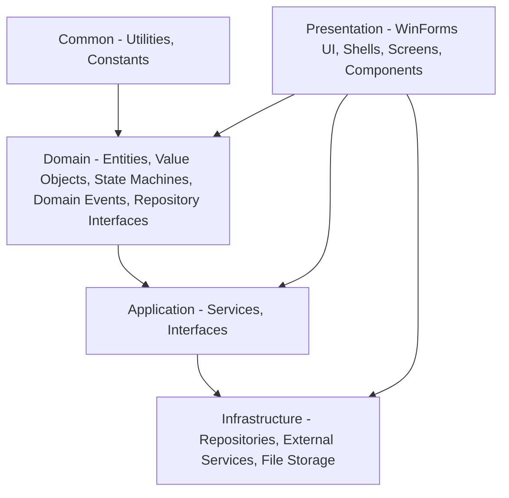

# RideGo — Architecture & Design Reference

> **Platform:** .NET Framework 4.8 · C# 7.3 · WinForms · Manual Service Composition
> **Applies to:** Ride-Hailing Simulation System (OOP2026)

---

## Table of Contents

1. [Overview](#1-overview)
2. [Dependency Rule & Pipeline](#2-dependency-rule--pipeline)
3. [Layer Architecture](#3-layer-architecture)
4. [Project Structure](#4-project-structure)
5. [Domain Model](#5-domain-model)
6. [State Machines](#6-state-machines)
7. [Domain Events](#7-domain-events)
8. [Design Patterns](#8-design-patterns)
9. [Application Services](#9-application-services)
10. [Repository & Persistence](#10-repository--persistence)
11. [External Services](#11-external-services)
12. [Manual Service Composition](#12-manual-service-composition)
13. [Use Cases](#13-use-cases)
14. [Business Logic](#14-business-logic)
15. [Naming Conventions](#15-naming-conventions)
16. [Coding Rules](#16-coding-rules)
17. [Checklist for New Files](#17-checklist-for-new-files)
18. [Known Gaps](#18-known-gaps)

---

## 1. Overview

RideGo is a ride-hailing simulation system built with C# WinForms, simulating the full trip workflow: book trip → find driver → travel → payment → rating.

### Goals

- Build complete business logic
- Apply four OOP pillars: Inheritance, Polymorphism, Encapsulation, Abstraction
- Simulate trip workflow with virtual data (no real GPS)

### Technology Stack

| Component | Details |
|-----------|---------|
| Runtime | .NET Framework 4.8 |
| UI | Windows Forms |
| Map | GMap.NET.WinForms 2.1.7 (Google Maps provider) |
| Serialization | Newtonsoft.Json |
| Service Composition | Manual — instantiate with `new` in `Program.cs` |
| Actors | Passenger, Driver, Admin |
| Storage | JSON files |

---

## 2. Dependency Rule & Pipeline

### Dependency Flow

```
Outer → Inner (outer layers depend on inner layers)

Presentation → Application → Infrastructure → Domain → Common
```

**Project References (.csproj):**

| Project | References |
|---------|-----------|
| Presentation | Application, Common, Domain, Infrastructure *(violation — see below)* |
| Application | Common, Domain |
| Infrastructure | Application, Common, Domain |
| Domain | Common |
| Common | *(none)* |

**Current violation:** Presentation references Domain and Infrastructure directly. Per Clean Architecture, Presentation should only reference Application (and Common for shared types).

### Pipeline (RideGo WinForms)

```
User Action (Button Click / Timer Tick)
  → WinForms Event Handler (Presentation)
    → Application Service Interface (ITripService, IUserService...)
      → Application Service Implementation
        → Domain Entity / State Machine
          → Repository Interface (Domain)
            → JsonRepository<T> (Infrastructure)
              → FileStorage → data/*.json
```

- **Observer Pattern** replaces middleware: `TripService.TripStatusChanged` event is subscribed by Forms for real-time UI updates without polling.
- **Composition Root** at `Program.cs` (Presentation) — initializes entire service graph with `new` directly (manual composition, no DI container).

**Note vs Web API pattern:**
- No HTTP middleware — replaced by WinForms event pipeline
- No MediatR — UI event handler calls Application Service directly
- No EF Core — replaced by `JsonRepository<T>` + `FileStorage`

---

## 3. Layer Architecture

### 5-Layer Architecture



| Layer | Responsibility | Key Components |
|-------|---------------|----------------|
| **Common** | Shared utilities, constants, extension methods | `Common/Utilities`, `Common/Constants`, `Common/Extensions` |
| **Domain** | Core business rules, no third-party dependencies | Entities, Value Objects, State Machines, Domain Events, Repository Interfaces |
| **Application** | Use case orchestration, business workflow | Services (`TripService`, `UserService`, `FareService`, `MatchingService`...), Interfaces |
| **Infrastructure** | External communication, data storage | `JsonRepository<T>`, `FileStorage`, `MapService`, Repository implementations |
| **Presentation** | User interaction | WinForms Shells, Screens, Components, ViewModels, Helpers, Manual composition root (`Program.cs`) |

### Composition Root

Composition root is at `Presentation/Program.cs` — all dependencies initialized with `new`:

- `JsonStorage<T>` (Infrastructure)
- Repositories (Infrastructure)
- Application services
- Background workers (`TripTimeoutWorker`, `TripMatchingWorker`)

UI forms receive dependencies via constructor (manual pass).

---

## 4. Project Structure

```
RideGo2026/
├── Application/
│   ├── Interfaces/       # IAdminService, IDriverService, IFareService, IMapService,
│   │                     # IMatchingService, IPassengerService, IReviewService,
│   │                     # ISimulationService, ITripService, IUserQueryService, IUserService
│   └── Services/         # AdminService, DriverService, FareService, MapService,
│                         # MatchingService, PassengerService, ReviewService,
│                         # SimulationService (stub), TripService, UserService
├── Domain/
│   ├── Enums/            # DriverStatus, TripStatus, VehicleType
│   ├── Entities/         # FareRule, Review, Trip, User (abstract),
│   │                     # Users/Admin, Driver, Passenger; Vehicles/Car, Motorbike, Vehicle
│   ├── Events/           # 9 Trip events, 2 Driver events, ReviewCreatedEvent
│   ├── SharedKernel/     # Entity.cs, ValueObject.cs, DomainEvent.cs
│   ├── StateMachines/    # DriverStateMachine.cs (static class)
│   ├── States/           # ITripState.cs + 8 state implementations
│   ├── Repositories/     # IRepository<T>, ITripRepository, IDriverRepository, etc.
│   └── ValueObjects/     # Address, Coordinate, Fare, Location, Money, Route
├── Infrastructure/
│   ├── ExternalServices/ # GMapService.cs, MapApiService.cs
│   ├── Interfaces/       # IFileStorageService, IFareRuleRepository, IGMapService, IMapApiService
│   └── Repositories/     # JsonRepository<T>, concrete repos, FileStorage, JsonStorage
├── Presentation/
│   ├── Components/       # DriverCardControl, FarePanel, LocationCard,
│   │                     # LocationPickerControl, MapControl, StatusPanel,
│   │                     # TripCard, TripStatusPanel
│   ├── Helpers/          # AlertHelper, DataMapper, EventHelper, MapHelper, UIHelper
│   ├── Screens/          # Auth/, Passenger/, Driver/, Admin/
│   ├── Shells/           # MainShell, PassengerShell, DriverShell, AdminShell
│   ├── ViewModels/       # PassengerViewModel, DriverViewModel, AdminViewModel, TripViewModel
│   ├── BaseForm.cs, BaseShell.cs, BaseUserControl.cs
│   └── Program.cs        # Manual composition root
└── Common/
    ├── Constants/        # FareConstants, SimulationConstants
    ├── Extensions/       # StringExtensions, DecimalExtensions
    ├── Helpers/          # PasswordHasher
    └── Utilities/        # PasswordHasher (duplicate — needs consolidation)
```

**Reserved folders (currently empty):** `Application/Features/`, `Application/DTOs/`, `Application/Behaviors/`, `Application/Mappings/`

---

## 5. Domain Model

### Inheritance Hierarchy

```
Entity (Domain.SharedKernel, abstract)
├── User (abstract)
│   ├── Passenger
│   ├── Driver
│   └── Admin
├── Vehicle (abstract)
│   ├── Car
│   └── Motorbike
├── Trip
├── FareRule
└── Review
```

### Entities

| Entity | Key Properties | Key Behaviors |
|--------|---------------|---------------|
| `User` (abstract) | `Id`, `Name`, `Phone`, `Password` (hashed), `IsActive` | `UpdateName()`, `ChangePassword()`, `VerifyPassword()` |
| `Passenger` | `TotalTrips` | `AddTrip()` |
| `Driver` | `Status`, `Position`, `VehicleId`, `Wallet`, `Income`, `TotalTrips`, `AverageRating`, `RatingSum`, `TotalReviews`, `LicenseNumber` | `SetAvailable()`, `SetOnTrip()`, `SetOffline()`, `UpdatePosition()`, `AddTrip()`, `PayCommission()`, `DepositToWallet()`, `UpdateReviews(int rating)` |
| `Admin` | (inherits User) | User management, system configuration |
| `Vehicle` (abstract) | `PlateNumber`, `Brand`, `Model`, `Color`, `Capacity`, `Type` | `GetAvgSpeed()`, `GetMaxPickupDistance()` (abstract) |
| `Car` | `Type = Car` | `AvgSpeed = 60km/h`, `MaxPickupDistance = 7km` |
| `Motorbike` | `Type = Motorbike` | `AvgSpeed = 40km/h`, `MaxPickupDistance = 5km` |
| `Trip` | `Status`, `PassengerId`, `DriverId?`, `VehicleType`, `Route`, `Fare`, `IsPaid`, `RequestAt` | State transitions: `SetSearching()`, `MatchDriver()`, `MarkAsArrived()`, `StartTrip()`, `CompleteTrip()`, `Cancel()`, `MarkTimeout()` |
| `FareRule` | `VehicleType`, `BaseFare`, `PricePerKm`, `CommissionRate` | `CalculateFare(distanceKm)` → `Fare` |
| `Review` | `DriverId`, `PassengerId`, `TripId`, `Rating`, `Comment`, `CreatedAt` | `UpdateReview()` |

### Value Objects

| Value Object | Components | Notes |
|-------------|-----------|-------|
| `Money` | `Amount` (decimal, 2dp), `Currency` (default "VND") | Immutable, operators `+`, `-`, `<`, `>`, `<=`, `>=` |
| `Coordinate` | `Latitude`, `Longitude` (double) | Primitive wrapper |
| `Address` | `Name`, `Street`, `District`, `City`, `Country`, `HouseNumber`, `Osm_Value`, `Locality` | From Geocoding API |
| `Location` | `Coordinate` + `Address` | Composite — immutable |
| `Route` | `Pickup`, `Destination`, `Distance`, `Duration`, `Polyline` (encoded) | Immutable; composition of two `Location` |
| `Fare` | `TotalAmount`, `Commission`, `DriverIncome` (computed) | Immutable |

### Repository Interfaces (Domain)

- `IRepository<T>` — base CRUD: Add, Update, Delete, GetAll, GetById, SaveChangesAsync, InitializeAsync
- `IReadRepository<T>` — read-only: GetAllAsync, GetByIdAsync
- Specific: `IUserRepository`, `IDriverRepository`, `IPassengerRepository`, `ITripRepository`, `IVehicleRepository`, `IReviewRepository`, `IFareRuleRepository`

---

## 6. State Machines

### Trip State Flow

```
Requested → Searching → Matched → Arrived → Started → Completed
                ↓         ↓         ↓         ↓
              Cancelled / Timeout (terminal states)
```

**Valid transitions:**

| From | To | Condition |
|------|-----|-----------|
| Requested | Searching | Trip created |
| Searching | Matched | Driver accepts |
| Searching | Cancelled | Passenger cancels |
| Searching | Timeout | Search timeout |
| Matched | Arrived | Driver arrives at pickup |
| Matched | Cancelled | Cancel before boarding |
| Arrived | Started | Passenger on board |
| Arrived | Cancelled | Passenger doesn't board |
| Started | Completed | Arrive at destination, pay |
| Started | Cancelled | Cancel mid-trip |

`ITripState` implementations validate transitions before delegating to `Trip.TransitionTo(...)`.

### Driver State Flow

```
Offline → Available → OnTrip → Available
```

`DriverStateMachine.CanTransition(from, to)` validates driver status transitions. Changes via `SetAvailable()`, `SetOnTrip()`, `SetOffline()`.

---

## 7. Domain Events

All inherit `DomainEvent` (base with `Id`, `OccurredOn`).

**Trip Events:**
- `TripRequestedEvent`, `TripSearchingEvent`, `TripMatchedEvent`, `TripArrivedEvent`, `TripStartedEvent`, `TripCompletedEvent`, `TripPaidEvent`, `TripCancelledEvent`, `TripTimeoutEvent`

**Driver Events:**
- `DriverStatusChangedEvent`, `DriverLocationUpdatedEvent`

**Review Event:**
- `ReviewCreatedEvent`

---

## 8. Design Patterns

| Pattern | Implementation |
|---------|---------------|
| **Repository** | `IRepository<T>` (Domain) → `JsonRepository<T>` (Infrastructure) → Concrete repos. No LINQ, uses list iteration. |
| **State Machine** | `ITripState` implementations validate Trip lifecycle; `DriverStateMachine` validates Driver transitions. |
| **Domain Events & Observer** | Aggregates emit events; `TripService.TripStatusChanged` for UI real-time updates. |
| **Value Object** | `Money`, `Location`, `Route`, `Fare` — immutable, value equality. |
| **Manual Service Composition** | All services instantiated with `new` in `Program.cs`. |

---

## 9. Application Services

**TripService:**
- `RequestTrip()`, `MatchDriverAsync()`, `ArriveAtPickup()`, `StartTrip()`, `CompleteTrip()`, `CancelTrip()`
- `TripStatusChanged` event for UI subscription

**UserService:**
- `RegisterPassenger()`, `RegisterDriver()`, `Login()`, profile management
- `UpdateDriverStatus()`, `UpdateDriverLocation()`, `TopUpDriverWallet()`

**MatchingService:**
- `MatchDriverToTripAsync()` — matches driver to trip with status + VehicleType check

**FareService:**
- `CalculateFare(VehicleType, double distanceKm)`

**ReviewService:**
- `AddReviewAsync()` — creates review + updates driver rating

**AdminService:**
- User/trip/fare rule management, statistics (GMV, NTR, completion rate, satisfaction)

**SimulationService:** Stub — no background tick.

---

## 10. Repository & Persistence

**Infrastructure Implementations:**
- `JsonRepository<T>` — generic base using `FileStorage.LoadAsync<T>` / `SaveAsync`
- Concrete repos inherit `JsonRepository<T>`
- `FileStorage` — static class with `ReaderWriterLockSlim` for thread-safe JSON I/O
- Data stored in `Data/*.json` files

**Concurrency:** `JsonRepository<T>` uses static `Mutex` per type to serialize file access.

---

## 11. External Services

**MapService** (`Infrastructure.ExternalServices`):
- `GetDistanceAsync()`, `GetRouteAsync()`, `SearchLocation()`, `ReverseGeocodeAsync()`
- Integrations: Photon Geocoding API + OSRM Routing API

**GMap.NET Separation:**

| Component | Layer | Package |
|-----------|-------|---------|
| `GMapControl` (UI widget) | **Presentation** | `GMap.NET.WinForms` |
| `GMapProviders` (Routing, Geocoding) | **Infrastructure** | `GMap.NET.Core` |

---

## 12. Manual Service Composition

Example from `Presentation/Program.cs`:

```csharp
// Storage
JsonStorage<User> userStorage = new JsonStorage<User>("data/users.json");
JsonStorage<Trip> tripStorage = new JsonStorage<Trip>("data/trips.json");

// Repositories
IUserRepository userRepo = new UserRepository(userStorage);
ITripRepository tripRepo = new TripRepository(tripStorage);

// External services
IMapService mapService = new MapService();

// Application Services
IUserService userService = new UserService(userRepo, ...);
ITripService tripService = new TripService(tripRepo, driverRepo, passengerRepo, mapService);

// Background workers
TripTimeoutWorker timeoutWorker = new TripTimeoutWorker(tripRepo);
TripMatchingWorker matchingWorker = new TripMatchingWorker(tripRepo, driverRepo, matchingService);

// Launch UI
Application.Run(new MainShell(userService, tripService, ...));
```

---

## 13. Use Cases

| ID | Use Case | Actor | Status |
|----|----------|-------|--------|
| UC1 | Login | User | ✅ |
| UC2 | Register Driver | Driver | ✅ |
| UC3 | Register Passenger | Passenger | ✅ |
| UC4 | Book Trip | Passenger | ✅ |
| UC5 | Match Driver | System | ⚠️ (basic check only) |
| UC6 | Arrive at Pickup | Driver | ✅ |
| UC7 | Start Trip | Driver | ✅ |
| UC8 | Complete Trip | Driver | ✅ |
| UC9 | Rate Trip | Passenger | ✅ |
| UC10 | Cancel Trip | Passenger/Driver | ✅ |
| UC11 | Trip History | Passenger/Driver | ✅ |
| UC12 | Matched Driver Info | Passenger | ✅ |
| UC13 | Work Status Toggle | Driver | ✅ |
| UC14 | Receive Trip Info | Driver | ✅ |
| UC15 | Accept/Reject Trip | Driver | ⚠️ (partial) |
| UC16 | Admin Real-time Monitor | Admin | ⚠️ (basic UI) |
| UC17 | Fare Rule Config | Admin | ✅ |
| UC18 | Driver Radar | Passenger | ❌ |
| UC19 | Driver Earnings | Driver | ✅ (entity ready, UI partial) |
| UC20 | Admin Reports | Admin | ✅ |
| UC21 | Navigation | Driver | ⚠️ (map display only) |
| UC22 | Edit Profile | User | ⚠️ (service ready, UI partial) |

---

## 14. Business Logic

### Fare Calculation

```
TotalFare = BaseFare + Distance × PricePerKm
Commission = TotalFare × CommissionRate
DriverIncome = TotalFare − Commission
```

### Matching Algorithm

1. Filter by vehicle type match
2. Exclude Offline / OnTrip drivers
3. Filter by administrative address (phường → quận → thành phố)
4. Check distance < MaxPickupDistance
5. Check wallet balance sufficient for commission
6. Send requests sequentially with timeout
7. Retry / fallback to Timeout

### Race Condition Handling

`SemaphoreSlim(1, 1)` lock around `MatchDriverAsync` to prevent double-assignment.

---

## 15. Naming Conventions

```
// Service interfaces — start with I
ITripService            ✅
TripServiceInterface    ❌

// Service implementations — no I prefix
TripService             ✅
TripServiceImpl         ❌

// Domain Events — past tense, clear
TripMatchedEvent        ✅
OnTripMatched           ❌ (On = JS style)

// Repository interfaces — start with I
ITripRepository         ✅
TripRepo                ❌

// Enums — PascalCase
TripStatus              ✅
tripStatus              ❌

// Value Objects — immutable, sealed
Money                   ✅
MoneyVO                 ❌

// Methods — Verb + Noun
RequestTrip()           ✅
TripRequest()           ❌
```

---

## 16. Coding Rules

| Rule | Educational Purpose | Implementation |
|------|---------------------|----------------|
| **No LINQ** | Master data structures & algorithms | Use `foreach` + `if-else` instead of `Where`, `FirstOrDefault` |
| **No `var`** | Static typing mindset | `Passenger p = new Passenger();` |
| **No Lambda** | Understand Delegate & Method | Explicit method declarations |
| **Newtonsoft.Json** | Persistence & Data Stream | `JsonConvert.SerializeObject` / `DeserializeObject` |

---

## 17. Checklist for New Files

| Question | If Yes → Place At |
|----------|-------------------|
| Business rule? | Domain / Entity or State Machine |
| Business logic not belonging to any Entity? | Domain Service (static class if simple) |
| Use case / flow orchestration? | Application / Service |
| Input validation? | Application / Service method |
| UI cross-cutting? | Presentation / Helper |
| Interface implementation? | Infrastructure / Repository or ExternalService |
| Primitive type / pure function? | Common / Constants, Extensions, Helpers |

---

## 18. Known Gaps

| Missing Item | Impact |
|-------------|--------|
| `IRouteService` / `RouteService` | Compile error — referenced but not found |
| `IDriverSimulationService` | Compile error — interface undefined |
| SimulationService is stub | No timer, no auto-movement |
| Polyline decoding incomplete | Route not displaying on MapControl |
| Driver Radar (UC18) | No proximity search |
| `Common/Exceptions/` folder | No custom exception base class |
| `Policies/` (Eligibility, Assignment) | Not present; logic inline in MatchingService |
| `InMemoryDriverCache` | Not present |

---

*Document version: 3.0 — Consolidated from RideGo_Architecture.md, CleanArchitecture_Final.md, Technical_Architecture.md. Updated for .NET Framework 4.8 WinForms constraints.*
