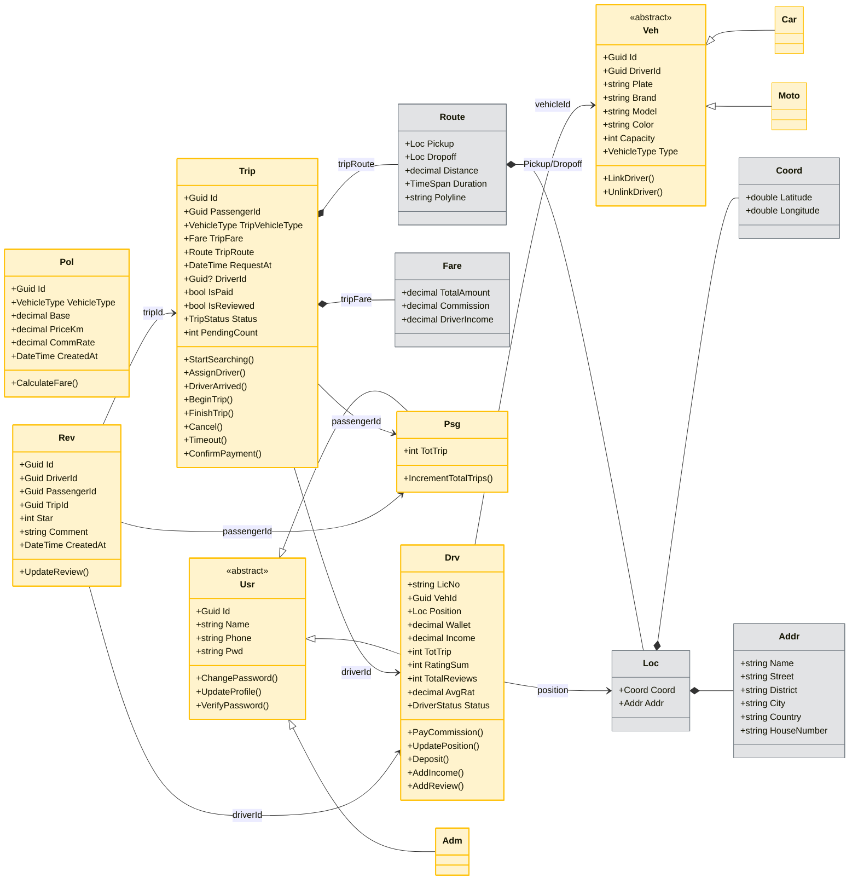
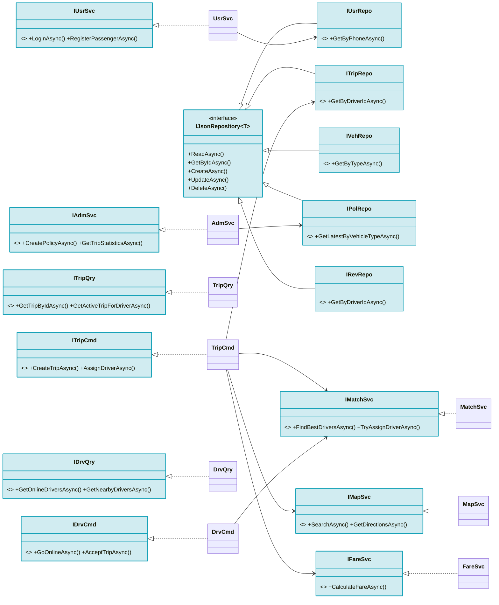

# Core Flows Class Diagram (Chi tiết theo Code)

Tài liệu này mô tả chi tiết cấu trúc lớp của hệ thống RideGo, phản ánh chính xác các interface, mẫu thiết kế và thuộc tính trong mã nguồn.

## 1. Sơ đồ Domain Model (Thực thể & Đối tượng Giá trị)



## 2. Sơ đồ Application Services & Repositories



## 3. Sơ đồ Mẫu thiết kế (State, Factory, Observer)

```mermaid
classDiagram
    direction LR

    %% State Pattern
    class IDriverState { <<interface>> +Status +SetOnline() +SetOnTrip() +SetOffline() }
    class ITripState { <<interface>> +Status +StartSearching() +AssignDriver() +BeginTrip() +FinishTrip() +Cancel() }
    class DriverStateFactory { +Create(status) IDriverState }
    class TripStateFactory { +Create(status) ITripState }
    
    Drv *-- IDriverState : currentState
    Trip *-- ITripState : currentState
    DriverStateFactory ..> IDriverState : creates
    TripStateFactory ..> ITripState : creates

    %% Factory Pattern
    class UserFactory { +CreateAdmin() +CreatePassenger() +CreateDriver() }
    class VehicleFactory { +CreateVehicle() }
    UserFactory ..> Usr : creates
    VehicleFactory ..> Veh : creates

    %% Observer Pattern
    class StatusMonitorBase~T~ { <<abstract>> +OnNext(T value) +Unsubscribe() }
    class DriverStatusMonitor { +Subscribe(Drv driver) }
    class TripStatusMonitor { +Subscribe(Trip trip) }
    class EventObservable~T~ { +Subscribe(IObserver observer) }
    
    StatusMonitorBase <|-- DriverStatusMonitor
    StatusMonitorBase <|-- TripStatusMonitor
    DriverStatusMonitor ..> EventObservable : uses
    TripStatusMonitor ..> EventObservable : uses
    
    Drv ..> DriverStatusChangedEventArgs : raises
    Trip ..> TripStatusChangedEventArgs : raises
    DriverStatusMonitor ..> Drv : observes
    TripStatusMonitor ..> Trip : observes

    %% Styles
    style IDriverState fill:#f8d7da,stroke:#dc3545,stroke-width:2px
    style ITripState fill:#f8d7da,stroke:#dc3545,stroke-width:2px
    style DriverStateFactory fill:#f8d7da,stroke:#dc3545,stroke-width:1px
    style TripStateFactory fill:#f8d7da,stroke:#dc3545,stroke-width:1px
    style UserFactory fill:#f8d7da,stroke:#dc3545,stroke-width:1px
    style VehicleFactory fill:#f8d7da,stroke:#dc3545,stroke-width:1px
    style StatusMonitorBase fill:#f8d7da,stroke:#dc3545,stroke-width:2px
    style DriverStatusMonitor fill:#f8d7da,stroke:#dc3545,stroke-width:1px
    style TripStatusMonitor fill:#f8d7da,stroke:#dc3545,stroke-width:1px