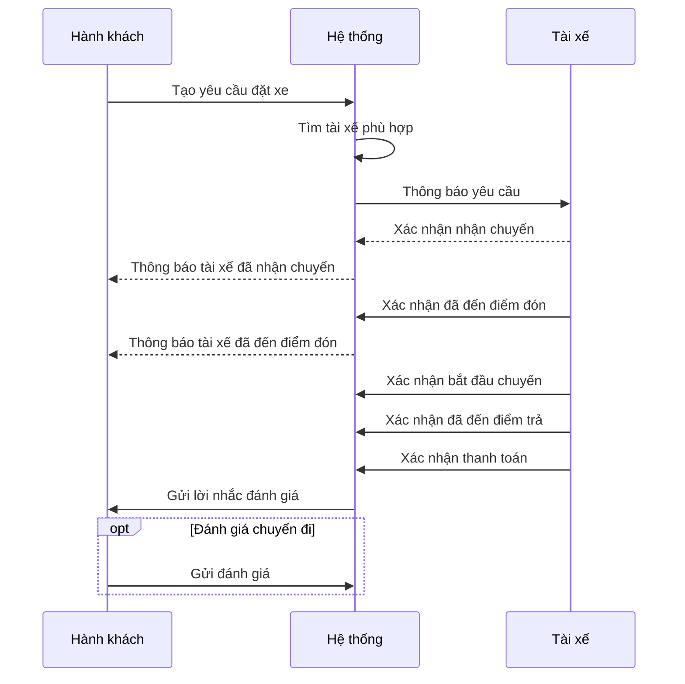
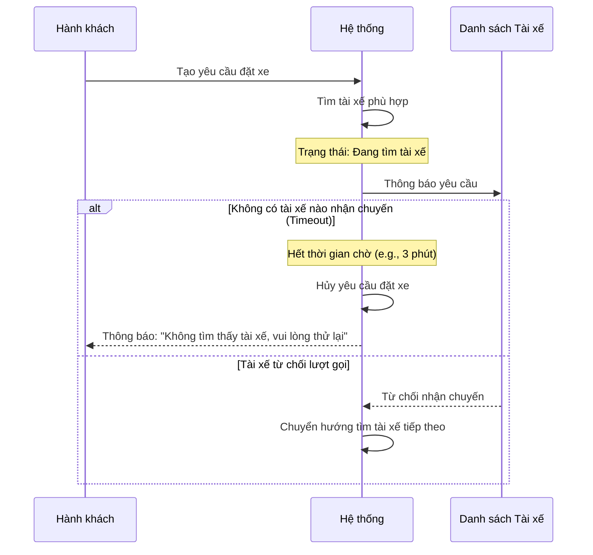
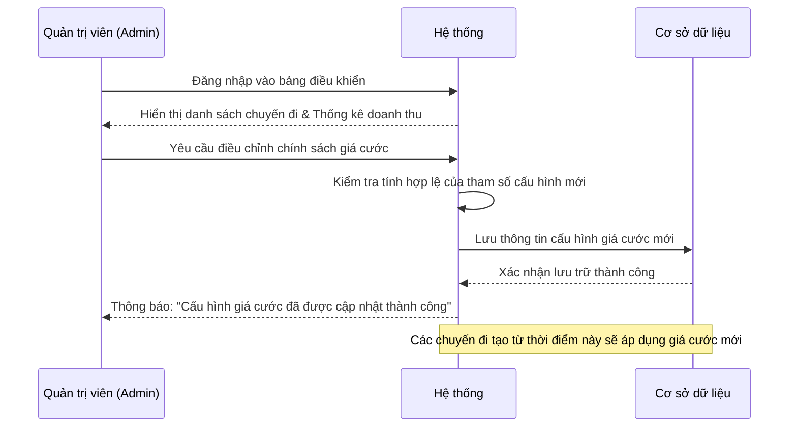

# Core Flows Sequence Diagrams

Tài liệu này mô tả các luồng nghiệp vụ chính của dự án RideGo thông qua các sơ đồ tuần tự (Sequence Diagrams).

## 1. Luồng đặt xe và hoàn thành (Core Flow)



## 2. Luồng Timeout và Từ chối



## 3. Luồng Quản trị (Admin)



## 4. Luồng Hủy chuyến

```mermaid
sequenceDiagram
    participant P as Hành khách
    participant S as Hệ thống
    participant D as Tài xế


    P->>S: Nhấn "Hủy chuyến"
   
    alt Trạng thái: Đang tìm tài xế
        S->>S: Dừng tiến trình quét xe trong hàng đợi
        S->>S: Cập nhật trạng thái chuyến đi: [Đã hủy]
        S-->>P: Xác nhận hủy chuyến thành công
       
    else Trạng thái: Đã ghép chuyến (Tài xế ĐANG DI CHUYỂN đến điểm đón)
        S->>S: Cập nhật trạng thái chuyến đi: [Đã hủy]
        S->>S: Chuyển trạng thái Tài xế: [Sẵn sàng]
        S->>D: Thông báo: "Chuyến đi đã bị hủy bởi Hành khách"
        S-->>P: Xác nhận hủy chuyến thành công
    end